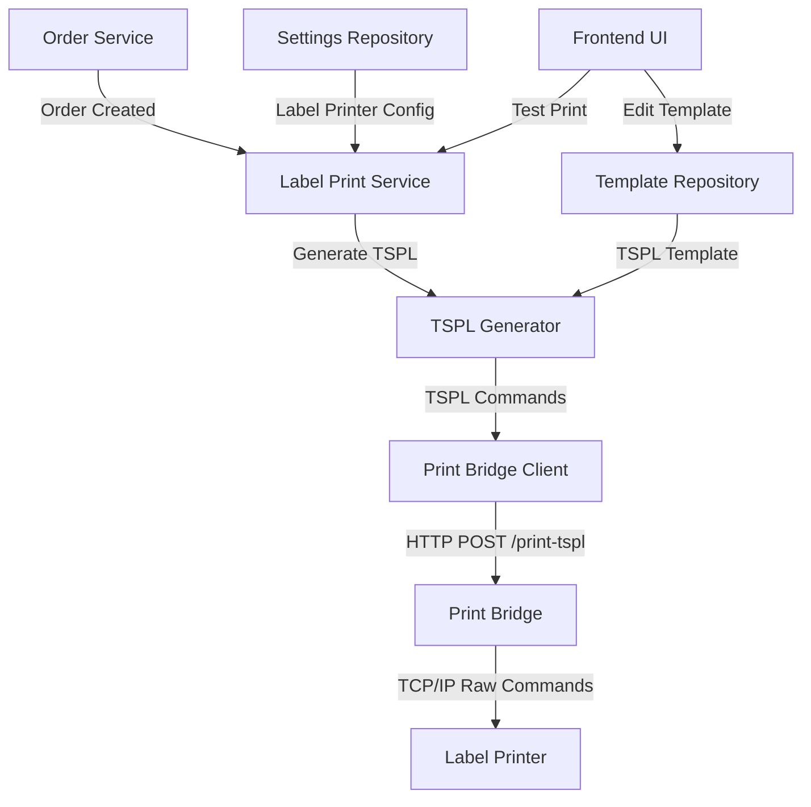
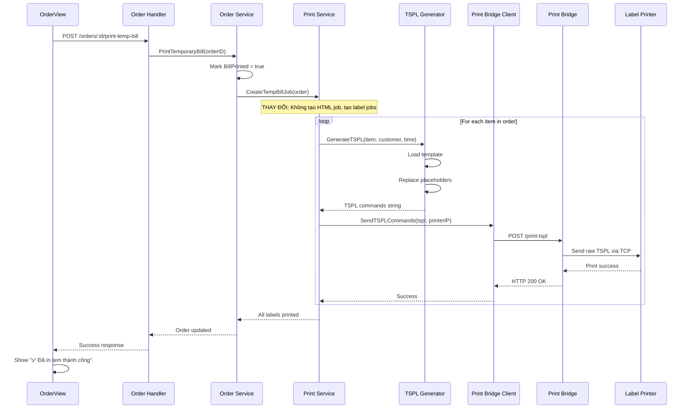

# Tài Liệu Thiết Kế: In Tem Đơn Hàng (Label Printing)

## Tổng Quan

Chức năng in tem **thay thế** chức năng in bill tạm hiện tại. Khi người dùng bấm nút "In bill tạm" (📄), hệ thống sẽ in tem nhãn cho từng món trong đơn hàng thay vì in bill HTML. Tem sử dụng giao thức TSPL (TSC Printer Language) và hiển thị: tên món, thời gian, và tên khách hàng.

### Mục Tiêu Thiết Kế

1. **Thay thế In Bill Tạm**: Button "In bill tạm" sẽ trigger in tem thay vì in bill HTML
2. **Tích hợp với Print Bridge**: Sử dụng print bridge hiện có để gửi lệnh TSPL đến máy in tem
3. **Template-based**: Cho phép tùy chỉnh template TSPL qua UI (thay thế temp bill template editor)
4. **Một tem cho mỗi món**: Mỗi item trong order sẽ có một tem riêng
5. **Linh hoạt**: Hỗ trợ nhiều kích thước tem khác nhau
6. **Đơn giản**: TSPL là text-based, dễ edit và debug

### Kiến Trúc Tổng Thể



### Luồng Xử Lý Chính

**Khi user bấm "In bill tạm" (📄):**




## Kiến Trúc

### Phân Tầng Hệ Thống

Hệ thống tuân theo Clean Architecture với các tầng:

#### 1. Infrastructure Layer

**File mới: `backend/infrastructure/printing/tspl_generator.go`**

Chịu trách nhiệm generate lệnh TSPL từ template và data:

```go
type TSPLGenerator struct {
    Width  int // mm (40, 50, 60)
    Height int // mm (30, 40)
    DPI    int // 203 hoặc 300
}

type LabelData struct {
    ItemName     string
    CustomerName string
    Time         string
    Quantity     int
    Note         string
}

func (g *TSPLGenerator) GenerateLabelCommands(data LabelData, template string) (string, error)
```

**File cập nhật: `backend/infrastructure/printbridge/client.go`**

Thêm method gửi TSPL commands qua print bridge:

```go
func (c *Client) SendTSPLCommands(ctx context.Context, tsplCommands string, printerIP string, port int) error
```

#### 2. Application Layer

**File cập nhật: `backend/application/services/print_service.go`**

Cập nhật method `CreateTempBillJob()` để in tem thay vì in bill HTML:

```go
// CreateTempBillJob - THAY ĐỔI: In tem thay vì in bill HTML
func (s *printService) CreateTempBillJob(ctx context.Context, ord *order.Order) error {
    // Get shop settings
    shopSettings, err := s.shopSettingsRepo.GetSettings(ctx)
    if err != nil {
        return fmt.Errorf("failed to get settings: %w", err)
    }
    
    // Check if label printer enabled
    if !shopSettings.LabelPrinterEnabled {
        return fmt.Errorf("label printer not enabled")
    }
    
    // Get print bridge client
    printBridgeClient := printbridge.NewClient(shopSettings.PrintBridgeURL, 30*time.Second)
    if !printBridgeClient.IsAvailable() {
        return fmt.Errorf("print bridge not available")
    }
    
    // Initialize TSPL generator
    tsplGenerator := printing.NewTSPLGenerator(
        shopSettings.LabelWidth,
        shopSettings.LabelHeight,
        203,
    )
    
    // Load template
    templateContent, err := os.ReadFile("./application/services/templates/label_template.tspl")
    if err != nil {
        return fmt.Errorf("failed to read template: %w", err)
    }
    
    // Print label for each item
    for _, item := range ord.Items {
        itemName := item.Name
        if item.VariantName != "" {
            itemName = fmt.Sprintf("%s (%s)", item.Name, item.VariantName)
        }
        
        data := printing.LabelData{
            ItemName:     itemName,
            CustomerName: ord.CustomerName,
            Time:         ord.CreatedAt.Format("15:04"),
            Quantity:     item.Quantity,
            Note:         item.Note,
            OrderNumber:  ord.OrderNumber,
        }
        
        // Generate TSPL
        tsplCommands, err := tsplGenerator.GenerateLabelCommands(data, string(templateContent))
        if err != nil {
            log.Printf("Failed to generate TSPL for item %s: %v", item.Name, err)
            continue // Skip this item, continue with others
        }
        
        // Send to printer via print bridge
        err = printBridgeClient.SendTSPLCommands(
            ctx,
            tsplCommands,
            shopSettings.LabelPrinterIP,
            shopSettings.LabelPrinterPort,
        )
        if err != nil {
            log.Printf("Failed to print label for item %s: %v", item.Name, err)
            // Continue with other items even if one fails
        }
    }
    
    return nil
}
```

#### 3. Interface Layer

**File mới: `backend/interfaces/http/label_template_handler.go`**

HTTP handlers cho label template management:

```go
type LabelTemplateHandler struct {
    orderRepo        OrderRepository
    shopSettingsRepo settings.ShopSettingsRepository
    labelPrintService *services.LabelPrintService
    templatePath     string
}

// API endpoints
func (h *LabelTemplateHandler) GetLabelTemplate(c *gin.Context)
func (h *LabelTemplateHandler) UpdateLabelTemplate(c *gin.Context)
func (h *LabelTemplateHandler) TestPrintLabel(c *gin.Context)
func (h *LabelTemplateHandler) PrintOrderLabels(c *gin.Context)
```

#### 4. Domain Layer

**File cập nhật: `backend/domain/settings/shop_settings.go`**

Thêm cấu hình máy in tem:

```go
type ShopSettings struct {
    // ... existing fields
    
    // Label Printer Settings (thay thế temp bill printer)
    LabelPrinterEnabled bool   `json:"label_printer_enabled" bson:"label_printer_enabled"`
    LabelPrinterIP      string `json:"label_printer_ip" bson:"label_printer_ip"`
    LabelPrinterPort    int    `json:"label_printer_port" bson:"label_printer_port"`
    LabelWidth          int    `json:"label_width" bson:"label_width"`   // mm
    LabelHeight         int    `json:"label_height" bson:"label_height"` // mm
}
```

#### 5. Frontend Layer

**File mới: `frontend/src/components/printing/LabelTemplateEditor.vue`**

Component cho edit TSPL template:

```vue
<template>
  <div class="label-template-editor">
    <div class="editor-section">
      <h3>TSPL Commands</h3>
      <textarea v-model="template" />
    </div>
    <div class="preview-section">
      <h3>Preview</h3>
      <div class="label-preview">
        <!-- Mock label preview -->
      </div>
    </div>
    <div class="actions">
      <button @click="saveTemplate">Lưu</button>
      <button @click="testPrint">Test Print</button>
    </div>
  </div>
</template>
```

**File cập nhật: `frontend/src/views/PrintManagementView.vue`**

Thay thế tab "Temp Bill" bằng "Label Template":

```vue
<template>
  <div class="print-management">
    <div class="tabs">
      <button @click="activeTab = 'bill'">Bill Template</button>
      <button @click="activeTab = 'label'">Label Template</button> <!-- THAY THẾ temp-bill -->
    </div>
    
    <BillTemplateEditor v-if="activeTab === 'bill'" />
    <LabelTemplateEditor v-if="activeTab === 'label'" /> <!-- THAY THẾ TempBillTemplateEditor -->
  </div>
</template>
```

**File cập nhật: `frontend/src/views/SettingsView.vue`**

Thêm section cho label printer settings (thay thế temp bill printer settings):

```vue
<div class="label-printer-settings">
  <h3>🏷️ Cấu Hình Máy In Tem (thay thế in bill tạm)</h3>
  
  <label>
    <input type="checkbox" v-model="settings.label_printer_enabled" />
    Bật máy in tem
  </label>
  
  <input v-model="settings.label_printer_ip" placeholder="IP máy in tem (192.168.1.100)" />
  <input v-model="settings.label_printer_port" placeholder="Port (9100)" />
  
  <select v-model="labelSize" @change="updateLabelSize">
    <option value="40x30">40mm x 30mm</option>
    <option value="50x30">50mm x 30mm (recommended)</option>
    <option value="60x40">60mm x 40mm</option>
  </select>
  
  <p class="text-sm text-gray-600">
    Khi bấm "In bill tạm", hệ thống sẽ in tem cho từng món trong đơn hàng
  </p>
</div>
```


## Thành Phần và Giao Diện

### 1. TSPL Generator

#### Interface

```go
package printing

import (
    "bytes"
    "fmt"
    "strings"
    "text/template"
)

type TSPLGenerator struct {
    Width  int // mm
    Height int // mm
    DPI    int // dots per inch (203 or 300)
}

type LabelData struct {
    OrderNumber  string // Mã order
    ItemName     string // Tên món
    Note         string // Note của món
    Time         string // Thời gian
    CustomerName string // Tên khách hàng
}

func NewTSPLGenerator(width, height, dpi int) *TSPLGenerator {
    return &TSPLGenerator{
        Width:  width,
        Height: height,
        DPI:    dpi,
    }
}

func (g *TSPLGenerator) GenerateLabelCommands(data LabelData, templateContent string) (string, error) {
    // Parse template
    tmpl, err := template.New("label").Parse(templateContent)
    if err != nil {
        return "", fmt.Errorf("failed to parse template: %w", err)
    }
    
    // Prepare template data with size info
    templateData := map[string]interface{}{
        "Width":        g.Width,
        "Height":       g.Height,
        "ItemName":     truncateText(data.ItemName, 20),
        "CustomerName": truncateText(data.CustomerName, 15),
        "Time":         data.Time,
        "Quantity":     data.Quantity,
        "Note":         truncateText(data.Note, 25),
        "OrderNumber":  data.OrderNumber,
    }
    
    // Execute template
    var buf bytes.Buffer
    if err := tmpl.Execute(&buf, templateData); err != nil {
        return "", fmt.Errorf("failed to execute template: %w", err)
    }
    
    return buf.String(), nil
}

func truncateText(text string, maxLen int) string {
    if len(text) <= maxLen {
        return text
    }
    return text[:maxLen-3] + "..."
}
```

#### Preconditions
- `width`, `height`, `dpi` phải là giá trị dương hợp lệ
- `templateContent` phải là TSPL template hợp lệ với placeholders
- `data.ItemName` không được rỗng

#### Postconditions
- Trả về chuỗi TSPL commands hợp lệ
- Text được truncate nếu quá dài
- Template placeholders được thay thế đúng

### 2. Print Bridge Client Extension

#### Interface

```go
package printbridge

import (
    "bytes"
    "context"
    "encoding/json"
    "fmt"
    "net/http"
)

type TSPLRequest struct {
    Commands  string `json:"commands"`
    PrinterIP string `json:"printer_ip"`
    Port      int    `json:"port"`
}

func (c *Client) SendTSPLCommands(ctx context.Context, tsplCommands string, printerIP string, port int) error {
    // Prepare request
    reqBody := TSPLRequest{
        Commands:  tsplCommands,
        PrinterIP: printerIP,
        Port:      port,
    }
    
    jsonData, err := json.Marshal(reqBody)
    if err != nil {
        return fmt.Errorf("failed to marshal request: %w", err)
    }
    
    // Create HTTP request
    url := fmt.Sprintf("%s/print-tspl", c.baseURL)
    req, err := http.NewRequestWithContext(ctx, "POST", url, bytes.NewBuffer(jsonData))
    if err != nil {
        return fmt.Errorf("failed to create request: %w", err)
    }
    
    req.Header.Set("Content-Type", "application/json")
    
    // Send request
    resp, err := c.httpClient.Do(req)
    if err != nil {
        return fmt.Errorf("failed to send request: %w", err)
    }
    defer resp.Body.Close()
    
    // Check response
    if resp.StatusCode != http.StatusOK {
        return fmt.Errorf("print bridge returned error: %d", resp.StatusCode)
    }
    
    return nil
}
```

#### Preconditions
- Print bridge phải đang chạy và accessible tại `c.baseURL`
- `tsplCommands` phải là TSPL commands hợp lệ
- `printerIP` phải là IP address hợp lệ
- `port` phải là port number hợp lệ (thường là 9100)

#### Postconditions
- TSPL commands được gửi đến print bridge thành công
- Print bridge forward commands đến máy in tem
- Trả về error nếu print bridge không available hoặc máy in không kết nối được

### 3. Label Print Service

#### Interface

```go
package services

import (
    "context"
    "fmt"
    "os"
    "time"
    
    "cafe-pos/backend/domain/order"
    "cafe-pos/backend/domain/settings"
    "cafe-pos/backend/infrastructure/printing"
    "cafe-pos/backend/infrastructure/printbridge"
    
    "go.mongodb.org/mongo-driver/bson/primitive"
)

type LabelPrintService struct {
    orderRepo         OrderRepository
    shopSettingsRepo  settings.ShopSettingsRepository
    tsplGenerator     *printing.TSPLGenerator
    printBridgeClient *printbridge.Client
    templatePath      string
}

func NewLabelPrintService(
    orderRepo OrderRepository,
    shopSettingsRepo settings.ShopSettingsRepository,
    templatePath string,
) *LabelPrintService {
    return &LabelPrintService{
        orderRepo:        orderRepo,
        shopSettingsRepo: shopSettingsRepo,
        templatePath:     templatePath,
    }
}

func (s *LabelPrintService) PrintOrderLabels(ctx context.Context, orderID primitive.ObjectID) error {
    // Get order
    ord, err := s.orderRepo.FindByID(ctx, orderID)
    if err != nil {
        return fmt.Errorf("failed to get order: %w", err)
    }
    
    // Get settings
    shopSettings, err := s.shopSettingsRepo.GetSettings(ctx)
    if err != nil {
        return fmt.Errorf("failed to get settings: %w", err)
    }
    
    // Check if label printer enabled
    if !shopSettings.LabelPrinterEnabled {
        return fmt.Errorf("label printer not enabled")
    }
    
    // Initialize generator and client
    s.tsplGenerator = printing.NewTSPLGenerator(
        shopSettings.LabelWidth,
        shopSettings.LabelHeight,
        203, // Default DPI
    )
    s.printBridgeClient = printbridge.NewClient(shopSettings.PrintBridgeURL, 30*time.Second)
    
    // Check print bridge availability
    if !s.printBridgeClient.IsAvailable() {
        return fmt.Errorf("print bridge not available")
    }
    
    // Load template
    templateContent, err := os.ReadFile(s.templatePath)
    if err != nil {
        return fmt.Errorf("failed to read template: %w", err)
    }
    
    // Print label for each item
    for _, item := range ord.Items {
        itemName := item.Name
        if item.VariantName != "" {
            itemName = fmt.Sprintf("%s (%s)", item.Name, item.VariantName)
        }
        
        data := printing.LabelData{
            ItemName:     itemName,
            CustomerName: ord.CustomerName,
            Time:         ord.CreatedAt.Format("15:04"),
            Quantity:     item.Quantity,
            Note:         item.Note,
            OrderNumber:  ord.OrderNumber,
        }
        
        // Generate TSPL commands
        tsplCommands, err := s.tsplGenerator.GenerateLabelCommands(data, string(templateContent))
        if err != nil {
            return fmt.Errorf("failed to generate TSPL: %w", err)
        }
        
        // Send to printer via print bridge
        err = s.printBridgeClient.SendTSPLCommands(
            ctx,
            tsplCommands,
            shopSettings.LabelPrinterIP,
            shopSettings.LabelPrinterPort,
        )
        if err != nil {
            return fmt.Errorf("failed to print label: %w", err)
        }
    }
    
    return nil
}

func (s *LabelPrintService) TestPrintLabel(ctx context.Context, data printing.LabelData, printerIP string, port int) error {
    // Get settings for print bridge URL and label size
    shopSettings, err := s.shopSettingsRepo.GetSettings(ctx)
    if err != nil {
        return fmt.Errorf("failed to get settings: %w", err)
    }
    
    // Initialize generator and client
    s.tsplGenerator = printing.NewTSPLGenerator(
        shopSettings.LabelWidth,
        shopSettings.LabelHeight,
        203,
    )
    s.printBridgeClient = printbridge.NewClient(shopSettings.PrintBridgeURL, 30*time.Second)
    
    // Load template
    templateContent, err := os.ReadFile(s.templatePath)
    if err != nil {
        return fmt.Errorf("failed to read template: %w", err)
    }
    
    // Generate TSPL
    tsplCommands, err := s.tsplGenerator.GenerateLabelCommands(data, string(templateContent))
    if err != nil {
        return fmt.Errorf("failed to generate TSPL: %w", err)
    }
    
    // Send to printer
    return s.printBridgeClient.SendTSPLCommands(ctx, tsplCommands, printerIP, port)
}
```

#### Preconditions
- Order phải tồn tại trong database
- Shop settings phải có cấu hình label printer hợp lệ
- Print bridge phải đang chạy
- Template file phải tồn tại

#### Postconditions
- Mỗi item trong order có một tem được in
- Nếu có lỗi, trả về error message chi tiết
- Không ảnh hưởng đến order data


### 4. HTTP Handler

#### Interface

```go
package http

import (
    "log"
    "os"
    
    "cafe-pos/backend/application/services"
    "cafe-pos/backend/infrastructure/printing"
    
    "github.com/gin-gonic/gin"
)

type LabelTemplateHandler struct {
    labelPrintService *services.LabelPrintService
    templatePath      string
}

func NewLabelTemplateHandler(
    labelPrintService *services.LabelPrintService,
    templatePath string,
) *LabelTemplateHandler {
    return &LabelTemplateHandler{
        labelPrintService: labelPrintService,
        templatePath:      templatePath,
    }
}

// GET /api/label-templates/order-item
func (h *LabelTemplateHandler) GetLabelTemplate(c *gin.Context) {
    content, err := os.ReadFile(h.templatePath)
    if err != nil {
        log.Printf("Failed to read label template: %v", err)
        c.JSON(500, gin.H{"error": "Failed to read template"})
        return
    }
    
    c.JSON(200, gin.H{
        "success": true,
        "content": string(content),
        "path":    h.templatePath,
    })
}

// PUT /api/label-templates/order-item
func (h *LabelTemplateHandler) UpdateLabelTemplate(c *gin.Context) {
    var req struct {
        Content string `json:"content" binding:"required"`
    }
    
    if err := c.ShouldBindJSON(&req); err != nil {
        c.JSON(400, gin.H{"error": "Invalid request: " + err.Error()})
        return
    }
    
    // Backup current template
    backupPath := h.templatePath + ".backup"
    if err := copyFile(h.templatePath, backupPath); err != nil {
        log.Printf("Warning: Failed to create backup: %v", err)
    }
    
    // Write new template
    if err := os.WriteFile(h.templatePath, []byte(req.Content), 0644); err != nil {
        log.Printf("Failed to write label template: %v", err)
        c.JSON(500, gin.H{"error": "Failed to save template"})
        return
    }
    
    c.JSON(200, gin.H{
        "success": true,
        "message": "Label template saved successfully",
        "backup":  backupPath,
    })
}

// POST /api/label-templates/test-print
func (h *LabelTemplateHandler) TestPrintLabel(c *gin.Context) {
    var req struct {
        ItemName     string `json:"item_name" binding:"required"`
        Note         string `json:"note"`
        CustomerName string `json:"customer_name" binding:"required"`
        PrinterIP    string `json:"printer_ip" binding:"required"`
        Port         int    `json:"port"`
    }
    
    if err := c.ShouldBindJSON(&req); err != nil {
        c.JSON(400, gin.H{"error": "Invalid request: " + err.Error()})
        return
    }
    
    // Default port
    if req.Port == 0 {
        req.Port = 9100
    }
    
    // Prepare test data
    data := printing.LabelData{
        OrderNumber:  "TEST-001",
        ItemName:     req.ItemName,
        Note:         req.Note,
        Time:         time.Now().Format("15:04"),
        CustomerName: req.CustomerName,
    }
    
    // Test print
    err := h.labelPrintService.TestPrintLabel(c.Request.Context(), data, req.PrinterIP, req.Port)
    if err != nil {
        log.Printf("Failed to test print label: %v", err)
        c.JSON(500, gin.H{"error": "Failed to print: " + err.Error()})
        return
    }
    
    c.JSON(200, gin.H{
        "success": true,
        "message": "Test print successful",
    })
}

// POST /api/orders/:id/print-labels
func (h *LabelTemplateHandler) PrintOrderLabels(c *gin.Context) {
    orderID, err := primitive.ObjectIDFromHex(c.Param("id"))
    if err != nil {
        c.JSON(400, gin.H{"error": "Invalid order ID"})
        return
    }
    
    err = h.labelPrintService.PrintOrderLabels(c.Request.Context(), orderID)
    if err != nil {
        log.Printf("Failed to print order labels: %v", err)
        c.JSON(500, gin.H{"error": "Failed to print labels: " + err.Error()})
        return
    }
    
    c.JSON(200, gin.H{
        "success": true,
        "message": "Labels printed successfully",
    })
}
```

#### API Endpoints

| Method | Endpoint | Description |
|--------|----------|-------------|
| GET | `/api/label-templates/order-item` | Lấy nội dung template TSPL |
| PUT | `/api/label-templates/order-item` | Cập nhật template TSPL |
| POST | `/api/label-templates/test-print` | Test in tem với data mẫu |
| POST | `/api/orders/:id/print-temp-bill` | **THAY ĐỔI**: In tem thay vì in bill HTML |

**Note**: Endpoint `/api/orders/:id/print-temp-bill` giữ nguyên tên để không break frontend, nhưng logic bên trong thay đổi từ in bill HTML sang in tem TSPL.

#### Request/Response Examples

**GET /api/label-templates/order-item**

Response:
```json
{
  "success": true,
  "content": "SIZE 50 mm, 30 mm\nGAP 2 mm, 0 mm\n...",
  "path": "./application/services/templates/label_template.tspl"
}
```

**PUT /api/label-templates/order-item**

Request:
```json
{
  "content": "SIZE 50 mm, 30 mm\nGAP 2 mm, 0 mm\nDIRECTION 1\n..."
}
```

Response:
```json
{
  "success": true,
  "message": "Label template saved successfully",
  "backup": "./application/services/templates/label_template.tspl.backup"
}
```

**POST /api/label-templates/test-print**

Request:
```json
{
  "item_name": "Cà phê sữa đá",
  "customer_name": "Nguyễn Văn A",
  "printer_ip": "192.168.1.100",
  "port": 9100,
  "quantity": 2,
  "note": "Ít đường"
}
```

Response:
```json
{
  "success": true,
  "message": "Test print successful"
}
```

**POST /api/orders/:id/print-labels**

Response:
```json
{
  "success": true,
  "message": "Labels printed successfully"
}
```


## Mô Hình Dữ Liệu

### Shop Settings Extension

Cập nhật `shop_settings` collection trong MongoDB:

```javascript
{
  _id: ObjectId,
  shop_name: "Cafe ABC",
  // ... existing fields
  
  // Label Printer Settings (thay thế temp bill printer)
  label_printer_enabled: true,
  label_printer_ip: "192.168.1.100",
  label_printer_port: 9100,
  label_width: 50,  // mm
  label_height: 30, // mm
  
  // Print Bridge URL (shared with bill printing)
  print_bridge_url: "http://localhost:8080",
  
  created_at: ISODate,
  updated_at: ISODate
}
```

### Template File

**File path**: `backend/application/services/templates/label_template.tspl`

**Default template content**:

```tspl
SIZE {{.Width}} mm, {{.Height}} mm
GAP 2 mm, 0 mm
DIRECTION 1
CODEPAGE UTF-8
CLS

TEXT 40,20,"3",0,1,1,"{{.OrderNumber}}"
TEXT 40,60,"4",0,1,1,"{{.ItemName}}"
{{if .Note}}
TEXT 40,100,"2",0,1,1,"({{.Note}})"
{{end}}
TEXT 40,140,"2",0,1,1,"{{.Time}}"
TEXT 40,180,"2",0,1,1,"{{.CustomerName}}"

PRINT 1
```

### Template Variables

| Variable | Type | Description | Example |
|----------|------|-------------|---------|
| `{{.Width}}` | int | Chiều rộng tem (mm) | 50 |
| `{{.Height}}` | int | Chiều cao tem (mm) | 30 |
| `{{.OrderNumber}}` | string | Mã order | "20260313-001" |
| `{{.ItemName}}` | string | Tên món (đã truncate) | "Cà phê sữa đá" |
| `{{.Note}}` | string | Ghi chú món (đã truncate) | "Ít đường" |
| `{{.Time}}` | string | Thời gian (HH:mm) | "14:30" |
| `{{.CustomerName}}` | string | Tên khách (đã truncate) | "Nguyễn Văn A" |

## Chi Tiết Kỹ Thuật TSPL

### Cấu Trúc Lệnh TSPL

#### Basic Commands

```tspl
SIZE width mm, height mm    // Kích thước tem
GAP gap mm, offset mm       // Khoảng cách giữa tem
DIRECTION direction         // 0=0°, 1=90°, 2=180°, 3=270°
CODEPAGE UTF-8              // Hỗ trợ tiếng Việt
CLS                         // Xóa buffer in
TEXT x, y, "font", rotation, x-mul, y-mul, "content"
PRINT quantity              // In
```

#### Font Sizes

| Font | Size (dots) | Use Case |
|------|-------------|----------|
| "1" | 8x12 | Text nhỏ, ghi chú |
| "2" | 10x16 | Text trung bình |
| "3" | 12x20 | Text lớn |
| "4" | 14x24 | Tiêu đề, tên món |
| "5" | 32x48 | Text rất lớn |

#### Coordinate System

- Origin (0,0) ở góc trên bên trái
- X axis: từ trái sang phải
- Y axis: từ trên xuống dưới
- Unit: dots (1mm ≈ 8 dots at 203 DPI)

#### Direction Values

- 0: In ngang, text từ trái sang phải
- 1: Xoay 90°, text từ dưới lên trên
- 2: Xoay 180°, text từ phải sang trái
- 3: Xoay 270°, text từ trên xuống dưới

### Template Examples

#### Template cho tem 40x30mm

```tspl
SIZE 40 mm, 30 mm
GAP 2 mm, 0 mm
DIRECTION 1
CODEPAGE UTF-8
CLS

TEXT 30,10,"2",0,1,1,"{{.OrderNumber}}"
TEXT 30,50,"3",0,1,1,"{{.ItemName}}"
{{if .Note}}
TEXT 30,90,"1",0,1,1,"({{.Note}})"
{{end}}
TEXT 30,120,"2",0,1,1,"{{.Time}}"
TEXT 30,160,"2",0,1,1,"{{.CustomerName}}"

PRINT 1
```

#### Template cho tem 50x30mm (recommended)

```tspl
SIZE 50 mm, 30 mm
GAP 2 mm, 0 mm
DIRECTION 1
CODEPAGE UTF-8
CLS

TEXT 40,20,"3",0,1,1,"{{.OrderNumber}}"
TEXT 40,60,"4",0,1,1,"{{.ItemName}}"
{{if .Note}}
TEXT 40,100,"2",0,1,1,"({{.Note}})"
{{end}}
TEXT 40,140,"2",0,1,1,"{{.Time}}"
TEXT 40,180,"2",0,1,1,"{{.CustomerName}}"

PRINT 1
```

#### Template cho tem 60x40mm

```tspl
SIZE 60 mm, 40 mm
GAP 2 mm, 0 mm
DIRECTION 1
CODEPAGE UTF-8
CLS

TEXT 50,30,"3",0,1,1,"{{.OrderNumber}}"
TEXT 50,90,"5",0,1,1,"{{.ItemName}}"
{{if .Note}}
TEXT 50,160,"2",0,1,1,"({{.Note}})"
{{end}}
TEXT 50,220,"3",0,1,1,"{{.Time}}"
TEXT 50,280,"3",0,1,1,"{{.CustomerName}}"

PRINT 1
```

### Xử Lý Tiếng Việt

#### Approach 1: CODEPAGE UTF-8

```tspl
CODEPAGE UTF-8
TEXT 40,20,"4",0,1,1,"Cà phê sữa đá"
```

**Pros**: Đơn giản, dễ implement
**Cons**: Không phải máy in nào cũng hỗ trợ UTF-8

#### Approach 2: Bitmap Rendering (Fallback)

Nếu máy in không hỗ trợ UTF-8, có thể render text thành bitmap:

```go
func (g *TSPLGenerator) RenderTextToBitmap(text string, fontSize int) ([]byte, error) {
    // Use image/draw to render text to bitmap
    // Convert to monochrome bitmap
    // Return bitmap data
}

// TSPL command
BITMAP x, y, width, height, mode, bitmap_data
```

**Note**: Implement fallback này nếu cần thiết sau khi test với máy in thật.

### Text Truncation Strategy

```go
func truncateText(text string, maxLen int) string {
    // Count runes, not bytes (for Vietnamese)
    runes := []rune(text)
    if len(runes) <= maxLen {
        return text
    }
    return string(runes[:maxLen-3]) + "..."
}
```

**Max lengths by field**:
- ItemName: 20 characters
- CustomerName: 15 characters
- Note: 25 characters


## Thuộc Tính Đúng Đắn (Correctness Properties)

*Thuộc tính (property) là một đặc điểm hoặc hành vi phải đúng trong tất cả các trường hợp thực thi hợp lệ của hệ thống.*

### Property 1: TSPL generation completeness

*Với mọi* LabelData hợp lệ và template hợp lệ, khi gọi `GenerateLabelCommands()`, output phải chứa tất cả các lệnh TSPL bắt buộc: SIZE, GAP, DIRECTION, CLS, ít nhất một lệnh TEXT, và PRINT.

**Validates: Requirements 1.2**

### Property 2: Template variable substitution

*Với mọi* LabelData và template chứa placeholders `{{.ItemName}}`, `{{.CustomerName}}`, `{{.Time}}`, output TSPL phải thay thế tất cả placeholders bằng giá trị tương ứng từ LabelData.

**Validates: Requirements 1.4**

### Property 3: Text truncation safety

*Với mọi* text field trong LabelData, nếu độ dài vượt quá max length quy định (ItemName: 20, CustomerName: 15, Note: 25), text phải được truncate và thêm "..." ở cuối, đếm theo số ký tự Unicode (runes) chứ không phải bytes.

**Validates: Requirements 2.2, 2.3, 2.4, 2.5**

### Property 4: Print bridge communication protocol

*Với mọi* TSPL commands string hợp lệ, khi gọi `SendTSPLCommands()`, nếu print bridge đang available, request phải được gửi đến endpoint `/print-tspl` với HTTP POST method, Content-Type là `application/json`, và request body chứa `commands`, `printer_ip`, và `port`.

**Validates: Requirements 1.5, 10.1, 10.2**

### Property 5: Label printer configuration validation

*Với mọi* shop settings, nếu `label_printer_enabled` là true, thì `label_printer_ip`, `label_printer_port`, `label_width`, và `label_height` phải có giá trị hợp lệ (IP không rỗng, port > 0, width và height > 0).

**Validates: Requirements 4.1**

### Property 6: Temp bill button triggers label printing

*Với mọi* request đến endpoint `/api/orders/:id/print-temp-bill`, hệ thống phải in tem (TSPL) cho tất cả items trong order, không phải in bill HTML.

**Validates: Requirements 1.1, 1.2**

### Property 7: One label per item

*Với mọi* Order có N items, khi gọi `PrintOrderLabels()`, hệ thống phải generate và gửi đúng N TSPL commands (một cho mỗi item).

**Validates: Requirements 6.1**

### Property 8: Template backup on update

*Với mọi* template update request, trước khi ghi template mới, hệ thống phải tạo backup file với suffix `.backup` của template hiện tại.

**Validates: Requirements 3.3**

### Property 9: Print bridge availability check

*Với mọi* print operation, trước khi gửi TSPL commands, hệ thống phải kiểm tra print bridge có đang chạy và accessible hay không.

**Validates: Requirements 5.1**

### Property 10: Error isolation in multi-item printing

*Với mọi* Order có nhiều items, nếu in tem cho một item thất bại, hệ thống phải tiếp tục in tem cho các items còn lại và log lỗi cho item thất bại mà không fail toàn bộ request.

**Validates: Requirements 6.2, 6.3**

### Property 11: Sequential printing order

*Với mọi* Order, các tem phải được in tuần tự (sequential) cho từng item, không in song song (parallel).

**Validates: Requirements 6.4**

### Property 12: Variant name formatting

*Với mọi* Order item có variant, tên món trong TSPL output phải theo format "Tên món (Variant)".

**Validates: Requirements 2.1**

### Property 13: Error logging completeness

*Với mọi* lỗi xảy ra trong quá trình in tem, hệ thống phải log chi tiết bao gồm order ID, item name, và error message.

**Validates: Requirements 5.6**

### Property 14: Template validation

*Với mọi* template update request, hệ thống phải reject template nếu chứa các lệnh nguy hiểm (DOWNLOAD, ERASE, KILL) hoặc kích thước vượt quá 10000 bytes.

**Validates: Requirements 9.1, 9.2**

### Property 15: Printer configuration validation

*Với mọi* printer IP và port được nhập, hệ thống phải validate IP address có format hợp lệ và port number là số dương hợp lệ.

**Validates: Requirements 9.3, 9.4**

### Property 16: Authentication and authorization

*Với mọi* API request liên quan đến label printing, hệ thống phải yêu cầu authentication, và chỉ cho phép users có role "admin" hoặc "manager" chỉnh sửa template và cấu hình máy in.

**Validates: Requirements 9.5, 9.6**

### Property 17: Print bridge response handling

*Với mọi* response từ Print_Bridge, hệ thống phải coi HTTP status 200 là thành công và bất kỳ status nào khác là thất bại.

**Validates: Requirements 10.3, 10.4**

### Property 18: Request timeout

*Với mọi* request đến Print_Bridge, hệ thống phải set timeout 30 giây.

**Validates: Requirements 10.5**

### Property 19: Test print data acceptance

*Với mọi* test print request, hệ thống phải chấp nhận dữ liệu mẫu bao gồm `item_name`, `note`, `customer_name`, `printer_ip`, và `port`.

**Validates: Requirements 7.2**

### Property 20: Test print execution

*Với mọi* test print request, hệ thống phải tạo lệnh TSPL với dữ liệu mẫu và gửi đến máy in được chỉ định trong request.

**Validates: Requirements 7.3**

## Xử Lý Lỗi

### Các Loại Lỗi

#### 1. Print Bridge Unavailable

**Nguyên nhân:**
- Print bridge service không chạy
- Network connection issue
- Wrong print bridge URL

**Xử lý:**
```go
if !printBridgeClient.IsAvailable() {
    return fmt.Errorf("print bridge not available at %s", printBridgeURL)
}
```

**User action:**
- Kiểm tra print bridge service đang chạy
- Kiểm tra URL trong settings
- Restart print bridge service

#### 2. Label Printer Offline

**Nguyên nhân:**
- Máy in tắt hoặc không kết nối
- Sai IP address
- Network issue

**Xử lý:**
```go
err := printBridgeClient.SendTSPLCommands(ctx, tspl, printerIP, port)
if err != nil {
    log.Printf("Failed to print label: %v", err)
    return fmt.Errorf("label printer offline or unreachable: %w", err)
}
```

**User action:**
- Kiểm tra máy in đã bật
- Kiểm tra IP address đúng
- Test connection từ settings

#### 3. Template Parse Error

**Nguyên nhân:**
- Template syntax không hợp lệ
- Missing closing brackets
- Invalid Go template syntax

**Xử lý:**
```go
tmpl, err := template.New("label").Parse(templateContent)
if err != nil {
    return "", fmt.Errorf("invalid template syntax: %w", err)
}
```

**User action:**
- Kiểm tra template syntax
- Restore từ backup
- Reset về default template

#### 4. Template File Not Found

**Nguyên nhân:**
- Template file bị xóa
- Wrong file path
- Permission issue

**Xử lý:**
```go
content, err := os.ReadFile(templatePath)
if err != nil {
    if os.IsNotExist(err) {
        // Create default template
        return createDefaultTemplate(templatePath)
    }
    return "", fmt.Errorf("failed to read template: %w", err)
}
```

**User action:**
- Restore từ backup
- Tạo template mới từ UI

#### 5. Label Printer Not Configured

**Nguyên nhân:**
- `label_printer_enabled` là false
- Missing printer IP/port
- Settings chưa được cấu hình

**Xử lý:**
```go
if !shopSettings.LabelPrinterEnabled {
    return fmt.Errorf("label printer not enabled in settings")
}

if shopSettings.LabelPrinterIP == "" {
    return fmt.Errorf("label printer IP not configured")
}
```

**User action:**
- Vào Settings
- Enable label printer
- Cấu hình IP và port

### Error Response Format

```json
{
  "error": "Failed to print labels: label printer offline or unreachable",
  "details": {
    "printer_ip": "192.168.1.100",
    "port": 9100,
    "error_type": "connection_timeout"
  },
  "suggestion": "Please check if the label printer is turned on and connected to the network"
}
```

### Logging Strategy

```go
// Info level
log.Printf("Printing labels for order %s: %d items", orderNumber, len(items))

// Warning level
log.Printf("Warning: Print bridge slow response time: %v", duration)

// Error level
log.Printf("Error printing label for order %s: %v", orderNumber, err)
log.Printf("TSPL commands: %s", tsplCommands) // For debugging
```


## Chiến Lược Testing

### Dual Testing Approach

Hệ thống sử dụng kết hợp hai loại testing:

#### 1. Property-Based Testing

Dùng để verify các universal properties trên nhiều inputs ngẫu nhiên.

**Library:** `gopter` cho Go backend

**Configuration:**
- Minimum 100 iterations per test
- Random seed for reproducibility
- Shrinking enabled for minimal failing examples

**Test Properties:**

```go
// Property 1: TSPL generation completeness
func TestProperty_TSPLGenerationCompleteness(t *testing.T) {
    properties := gopter.NewProperties(nil)
    
    properties.Property("Generated TSPL contains all required commands",
        prop.ForAll(
            func(data LabelData) bool {
                generator := NewTSPLGenerator(50, 30, 203)
                template := getDefaultTemplate()
                
                tspl, err := generator.GenerateLabelCommands(data, template)
                if err != nil {
                    return false
                }
                
                // Check required commands present
                return strings.Contains(tspl, "SIZE") &&
                       strings.Contains(tspl, "GAP") &&
                       strings.Contains(tspl, "DIRECTION") &&
                       strings.Contains(tspl, "CLS") &&
                       strings.Contains(tspl, "TEXT") &&
                       strings.Contains(tspl, "PRINT")
            },
            genLabelData(),
        ))
    
    properties.TestingRun(t, gopter.ConsoleReporter(false))
}

// Property 2: Template variable substitution
func TestProperty_TemplateVariableSubstitution(t *testing.T) {
    properties := gopter.NewProperties(nil)
    
    properties.Property("All template variables are substituted",
        prop.ForAll(
            func(data LabelData) bool {
                generator := NewTSPLGenerator(50, 30, 203)
                template := getDefaultTemplate()
                
                tspl, err := generator.GenerateLabelCommands(data, template)
                if err != nil {
                    return false
                }
                
                // Check no unsubstituted placeholders
                return !strings.Contains(tspl, "{{.ItemName}}") &&
                       !strings.Contains(tspl, "{{.CustomerName}}") &&
                       !strings.Contains(tspl, "{{.Time}}") &&
                       strings.Contains(tspl, data.ItemName) &&
                       strings.Contains(tspl, data.CustomerName)
            },
            genLabelData(),
        ))
    
    properties.TestingRun(t, gopter.ConsoleReporter(false))
}

// Property 3: Text truncation safety
func TestProperty_TextTruncationSafety(t *testing.T) {
    properties := gopter.NewProperties(nil)
    
    properties.Property("Long text is truncated to max length",
        prop.ForAll(
            func(longText string) bool {
                truncated := truncateText(longText, 20)
                
                // Check length constraint
                return len([]rune(truncated)) <= 20
            },
            gen.AnyString(),
        ))
    
    properties.TestingRun(t, gopter.ConsoleReporter(false))
}

// Property 7: One label per item
func TestProperty_OneLabelPerItem(t *testing.T) {
    properties := gopter.NewProperties(nil)
    
    properties.Property("Prints one label for each order item",
        prop.ForAll(
            func(order *Order) bool {
                // Mock print bridge to count calls
                mockClient := &MockPrintBridgeClient{CallCount: 0}
                service := NewLabelPrintService(orderRepo, settingsRepo, templatePath)
                service.printBridgeClient = mockClient
                
                err := service.PrintOrderLabels(ctx, order.ID)
                if err != nil {
                    return false
                }
                
                // Check call count equals item count
                return mockClient.CallCount == len(order.Items)
            },
            genOrder(),
        ))
    
    properties.TestingRun(t, gopter.ConsoleReporter(false))
}
```

**Generators:**

```go
func genLabelData() gopter.Gen {
    return gopter.CombineGens(
        gen.AnyString(),
        gen.AnyString(),
        gen.RegexMatch("[0-2][0-9]:[0-5][0-9]"),
        gen.IntRange(1, 10),
        gen.AnyString(),
        gen.RegexMatch("ORD-[0-9]+"),
    ).Map(func(values []interface{}) LabelData {
        return LabelData{
            ItemName:     values[0].(string),
            CustomerName: values[1].(string),
            Time:         values[2].(string),
            Quantity:     values[3].(int),
            Note:         values[4].(string),
            OrderNumber:  values[5].(string),
        }
    })
}

func genOrder() gopter.Gen {
    return gopter.CombineGens(
        gen.Identifier(),
        gen.SliceOf(genOrderItem()),
    ).Map(func(values []interface{}) *Order {
        return &Order{
            ID:           primitive.NewObjectID(),
            OrderNumber:  values[0].(string),
            Items:        values[1].([]OrderItem),
            CustomerName: "Test Customer",
            CreatedAt:    time.Now(),
        }
    })
}
```

#### 2. Unit Testing

Dùng để verify specific examples và edge cases.

**Focus Areas:**

```go
// Test specific TSPL output format
func TestTSPLGenerator_GenerateCommands_ValidOutput(t *testing.T) {
    generator := NewTSPLGenerator(50, 30, 203)
    data := LabelData{
        ItemName:     "Cà phê sữa đá",
        CustomerName: "Nguyễn Văn A",
        Time:         "14:30",
        Quantity:     2,
        Note:         "Ít đường",
        OrderNumber:  "ORD-001",
    }
    
    template := `SIZE {{.Width}} mm, {{.Height}} mm
CLS
TEXT 40,20,"4",0,1,1,"{{.ItemName}}"
PRINT 1`
    
    tspl, err := generator.GenerateLabelCommands(data, template)
    
    assert.NoError(t, err)
    assert.Contains(t, tspl, "SIZE 50 mm, 30 mm")
    assert.Contains(t, tspl, "Cà phê sữa đá")
}

// Test text truncation edge cases
func TestTruncateText_EdgeCases(t *testing.T) {
    tests := []struct {
        name     string
        input    string
        maxLen   int
        expected string
    }{
        {
            name:     "Empty string",
            input:    "",
            maxLen:   20,
            expected: "",
        },
        {
            name:     "Exact length",
            input:    "12345678901234567890",
            maxLen:   20,
            expected: "12345678901234567890",
        },
        {
            name:     "One over",
            input:    "123456789012345678901",
            maxLen:   20,
            expected: "12345678901234567...",
        },
        {
            name:     "Vietnamese characters",
            input:    "Cà phê sữa đá size lớn thêm đường",
            maxLen:   20,
            expected: "Cà phê sữa đá siz...",
        },
    }
    
    for _, tt := range tests {
        t.Run(tt.name, func(t *testing.T) {
            result := truncateText(tt.input, tt.maxLen)
            assert.Equal(t, tt.expected, result)
            assert.LessOrEqual(t, len([]rune(result)), tt.maxLen)
        })
    }
}

// Test print bridge client error handling
func TestPrintBridgeClient_SendTSPLCommands_ErrorHandling(t *testing.T) {
    tests := []struct {
        name          string
        serverStatus  int
        serverRunning bool
        expectError   bool
    }{
        {
            name:          "Success",
            serverStatus:  200,
            serverRunning: true,
            expectError:   false,
        },
        {
            name:          "Server error",
            serverStatus:  500,
            serverRunning: true,
            expectError:   true,
        },
        {
            name:          "Server not running",
            serverRunning: false,
            expectError:   true,
        },
    }
    
    for _, tt := range tests {
        t.Run(tt.name, func(t *testing.T) {
            // Setup mock server
            var server *httptest.Server
            if tt.serverRunning {
                server = httptest.NewServer(http.HandlerFunc(func(w http.ResponseWriter, r *http.Request) {
                    w.WriteHeader(tt.serverStatus)
                }))
                defer server.Close()
            }
            
            client := NewClient(server.URL, 5*time.Second)
            err := client.SendTSPLCommands(context.Background(), "SIZE 50 mm, 30 mm", "192.168.1.100", 9100)
            
            if tt.expectError {
                assert.Error(t, err)
            } else {
                assert.NoError(t, err)
            }
        })
    }
}

// Test label print service integration
func TestLabelPrintService_PrintOrderLabels_Integration(t *testing.T) {
    // Setup test database
    db := setupTestDB(t)
    defer db.Cleanup()
    
    // Create test order
    order := &Order{
        ID:           primitive.NewObjectID(),
        OrderNumber:  "TEST-001",
        CustomerName: "Test Customer",
        Items: []OrderItem{
            {Name: "Item 1", Quantity: 1},
            {Name: "Item 2", Quantity: 2},
        },
        CreatedAt: time.Now(),
    }
    db.Orders.Insert(order)
    
    // Setup mock print bridge
    mockPrintBridge := &MockPrintBridgeClient{}
    
    // Create service
    service := NewLabelPrintService(db.OrderRepo, db.SettingsRepo, "./test_template.tspl")
    service.printBridgeClient = mockPrintBridge
    
    // Execute
    err := service.PrintOrderLabels(context.Background(), order.ID)
    
    // Verify
    assert.NoError(t, err)
    assert.Equal(t, 2, mockPrintBridge.CallCount)
}
```

### Frontend Testing

**Component Tests (Vitest + Vue Test Utils):**

```typescript
// LabelTemplateEditor.spec.ts
describe('LabelTemplateEditor', () => {
  it('loads template on mount', async () => {
    const wrapper = mount(LabelTemplateEditor)
    await flushPromises()
    
    expect(wrapper.find('textarea').element.value).toContain('SIZE')
  })
  
  it('saves template on button click', async () => {
    const wrapper = mount(LabelTemplateEditor)
    const saveButton = wrapper.find('[data-test="save-button"]')
    
    await saveButton.trigger('click')
    
    expect(api.updateLabelTemplate).toHaveBeenCalled()
  })
  
  it('shows error message on save failure', async () => {
    api.updateLabelTemplate.mockRejectedValue(new Error('Save failed'))
    const wrapper = mount(LabelTemplateEditor)
    
    await wrapper.find('[data-test="save-button"]').trigger('click')
    await flushPromises()
    
    expect(wrapper.text()).toContain('Failed to save')
  })
})
```

### Integration Testing

**End-to-end flow tests:**

1. **Order Creation → Auto Print Labels**
   - Create order via API
   - Verify labels printed automatically (if enabled)
   - Check print bridge received correct TSPL commands

2. **Manual Print from Order View**
   - Load order detail page
   - Click "In Tem" button
   - Verify API call made
   - Verify success message shown

3. **Template Edit → Test Print**
   - Edit template in UI
   - Save template
   - Test print with sample data
   - Verify TSPL sent to printer


## Performance Considerations

### Printing Speed

**Sequential vs Parallel:**
- Hiện tại: In từng tem tuần tự (sequential)
- Lý do: Đơn giản, dễ debug, tránh overload printer
- Trade-off: Với order có nhiều items (>10), có thể chậm

**Optimization nếu cần:**
```go
// Parallel printing với goroutines
var wg sync.WaitGroup
errChan := make(chan error, len(order.Items))

for _, item := range order.Items {
    wg.Add(1)
    go func(item OrderItem) {
        defer wg.Done()
        if err := printLabel(item); err != nil {
            errChan <- err
        }
    }(item)
}

wg.Wait()
close(errChan)
```

**Note**: Chỉ implement nếu sequential printing quá chậm trong thực tế.

### Template Caching

**Current approach**: Load template từ file mỗi lần in

**Optimization nếu cần:**
```go
type LabelPrintService struct {
    // ... existing fields
    templateCache     string
    templateCacheTime time.Time
    cacheDuration     time.Duration
}

func (s *LabelPrintService) loadTemplate() (string, error) {
    // Check cache
    if time.Since(s.templateCacheTime) < s.cacheDuration {
        return s.templateCache, nil
    }
    
    // Load from file
    content, err := os.ReadFile(s.templatePath)
    if err != nil {
        return "", err
    }
    
    // Update cache
    s.templateCache = string(content)
    s.templateCacheTime = time.Now()
    
    return s.templateCache, nil
}
```

### Network Latency

**Print bridge communication:**
- HTTP request overhead: ~10-50ms
- TCP connection to printer: ~50-200ms
- Total per label: ~100-300ms

**For 10 items**: ~1-3 seconds total (acceptable)

**Timeout configuration:**
```go
printBridgeClient := printbridge.NewClient(url, 30*time.Second)
```

## Security Considerations

### Input Validation

**Template content:**
```go
func validateTemplate(content string) error {
    // Check for dangerous commands
    dangerous := []string{"DOWNLOAD", "ERASE", "KILL"}
    for _, cmd := range dangerous {
        if strings.Contains(content, cmd) {
            return fmt.Errorf("template contains dangerous command: %s", cmd)
        }
    }
    
    // Check template size
    if len(content) > 10000 {
        return fmt.Errorf("template too large")
    }
    
    return nil
}
```

**Printer IP validation:**
```go
func validatePrinterIP(ip string) error {
    parsed := net.ParseIP(ip)
    if parsed == nil {
        return fmt.Errorf("invalid IP address")
    }
    
    // Prevent access to localhost/internal IPs if needed
    if parsed.IsLoopback() {
        return fmt.Errorf("loopback address not allowed")
    }
    
    return nil
}
```

### Access Control

**API endpoints:**
- Tất cả endpoints yêu cầu authentication
- Chỉ admin/manager có quyền edit template
- Chỉ admin/manager có quyền thay đổi printer settings

```go
// Middleware
router.PUT("/api/label-templates/order-item", 
    authMiddleware.RequireRole("admin", "manager"),
    handler.UpdateLabelTemplate)
```

### Print Bridge Security

**Communication:**
- Print bridge chạy local, không expose ra internet
- Backend → Print bridge: HTTP (local network)
- Print bridge → Printer: Raw TCP (local network)

**No sensitive data:**
- TSPL commands chỉ chứa: tên món, tên khách, thời gian
- Không có thông tin thanh toán, số tiền

## Dependencies

### Backend Dependencies

**Existing:**
- `go.mongodb.org/mongo-driver` - MongoDB driver
- `github.com/gin-gonic/gin` - HTTP framework
- Standard library: `text/template`, `net/http`, `os`

**New (for testing):**
- `github.com/leanovate/gopter` - Property-based testing
- `github.com/stretchr/testify` - Assertions

### Frontend Dependencies

**Existing:**
- Vue 3
- Pinia (state management)
- Axios (HTTP client)

**New:**
- None (sử dụng existing dependencies)

### External Services

**Print Bridge:**
- Local service chạy trên máy có kết nối với máy in
- Endpoint: `http://localhost:8080` (configurable)
- Cần implement endpoint mới: `POST /print-tspl`

**Label Printer:**
- TSC printer hoặc tương thích TSPL
- Kết nối: TCP/IP network
- Port: 9100 (standard)

## Implementation Roadmap

### Phase 1: Backend Core (3-4 giờ)

1. **TSPL Generator** (1 giờ)
   - Tạo `tspl_generator.go`
   - Implement `GenerateLabelCommands()`
   - Implement `truncateText()`
   - Unit tests

2. **Print Bridge Extension** (1 giờ)
   - Cập nhật `client.go`
   - Implement `SendTSPLCommands()`
   - Unit tests với mock server

3. **Label Print Service** (1 giờ)
   - Tạo `label_print_service.go`
   - Implement `PrintOrderLabels()`
   - Implement `TestPrintLabel()`
   - Integration tests

4. **HTTP Handler** (1 giờ)
   - Tạo `label_template_handler.go`
   - Implement 4 endpoints
   - Wire up trong `main.go`

### Phase 2: Settings & Template (2 giờ)

1. **Shop Settings Extension** (30 phút)
   - Cập nhật `shop_settings.go`
   - Migration script (nếu cần)
   - Update settings API

2. **Default Template** (30 phút)
   - Tạo `label_template.tspl`
   - Template cho 3 kích thước: 40x30, 50x30, 60x40
   - **XÓA hoặc DEPRECATE**: `temp_bill_template.html` (không dùng nữa)

3. **Settings UI** (1 giờ)
   - Cập nhật `SettingsView.vue`
   - Thêm label printer settings section
   - **XÓA**: Temp bill printer settings (nếu có)

### Phase 3: Frontend UI (3 giờ)

1. **Label Template Editor** (2 giờ)
   - Tạo `LabelTemplateEditor.vue` (base on TempBillTemplateEditor.vue)
   - Text editor cho TSPL
   - Preview section (mock label)
   - Save và test print buttons
   - API integration

2. **Print Management View** (30 phút)
   - Cập nhật `PrintManagementView.vue`
   - **THAY THẾ** tab "Temp Bill" bằng "Label Template"
   - **XÓA** import TempBillTemplateEditor
   - **THÊM** import LabelTemplateEditor

3. **Order View** (30 phút)
   - **GIỮ NGUYÊN** button "📄 In bill tạm"
   - **THAY ĐỔI** message: "✅ Đã in tem thành công" thay vì "Đã in bill tạm"
   - API endpoint giữ nguyên: `/orders/:id/print-temp-bill`

### Phase 4: Integration & Testing (2 giờ)

1. **Print Service Integration** (1 giờ)
   - Cập nhật `print_service.go` method `CreateTempBillJob()`
   - **THAY ĐỔI**: Logic từ render HTML sang generate TSPL
   - Error handling
   - **XÓA**: `renderTempBillHTML()` method (không dùng nữa)

2. **Property-Based Tests** (30 phút)
   - Implement generators
   - Write property tests
   - Run với 100+ iterations

3. **End-to-End Testing** (30 phút)
   - Test button "In bill tạm" → in tem
   - Test với các kích thước tem khác nhau
   - Test với tên món dài, tiếng Việt
   - Test error scenarios

### Phase 5: Print Bridge Implementation (2 giờ)

**Note**: Print bridge là separate service, có thể implement song song

1. **Endpoint Implementation** (1 giờ)
   - Add `POST /print-tspl` endpoint
   - Parse request body
   - Open TCP connection to printer
   - Send raw TSPL commands
   - Return response

2. **Testing** (1 giờ)
   - Test với máy in thật
   - Test error handling
   - Test với nhiều requests đồng thời

### Total Estimated Time: 12-13 giờ

**Breakdown:**
- Backend: 5-6 giờ
- Frontend: 3 giờ
- Integration & Testing: 2 giờ
- Print Bridge: 2 giờ

## Tài Liệu Tham Khảo

### TSPL Documentation

- [TSC TSPL Programming Manual](https://www.tscprinters.com/EN/Download/Software)
- [TSPL Command Reference](https://www.tscprinters.com/cms/upload/download_en/TSPL_TSPL2_Programming.pdf)

### Label Sizes

| Size | Use Case | Common Products |
|------|----------|-----------------|
| 40x30mm | Nhỏ, đồ uống | Cà phê, trà sữa |
| 50x30mm | Standard | Đồ ăn, đồ uống |
| 60x40mm | Lớn | Món ăn, combo |
| 100x50mm | Rất lớn | Shipping labels |

### Printer Compatibility

**Tested with:**
- TSC TTP-244 Plus
- TSC TTP-345
- TSC TE200

**Should work with:**
- Bất kỳ máy in nào hỗ trợ TSPL protocol
- Zebra printers (với TSPL emulation mode)

## Kết Luận

Chức năng in tem sử dụng kiến trúc tương tự như in bill hiện tại:
- Print bridge làm trung gian giữa backend và máy in
- Backend generate TSPL commands từ template
- Template là text file, dễ customize qua UI
- Hỗ trợ nhiều kích thước tem
- Tự động in khi tạo order (optional)
- Error handling và logging đầy đủ

Thiết kế này đơn giản, dễ maintain, và tận dụng infrastructure hiện có (print bridge, settings, template management).
