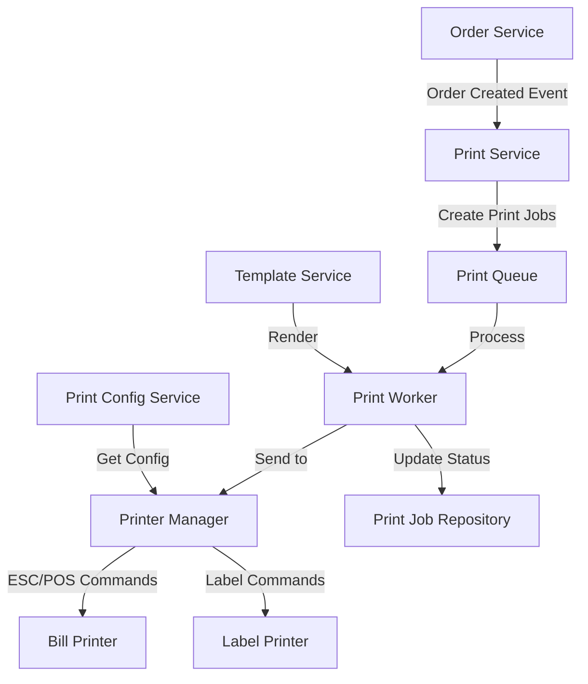
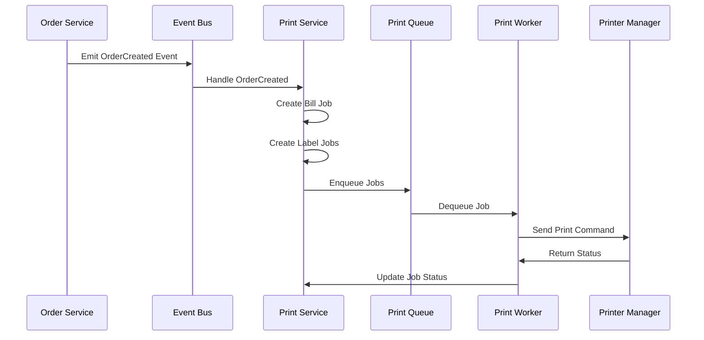

# Tài Liệu Thiết Kế: In Bill và Tem Đơn Hàng

## Tổng Quan

Hệ thống in bill và tem cho phép tự động in hóa đơn thanh toán (bill) và nhãn dán sản phẩm (tem) khi đơn hàng được tạo. Thiết kế này tích hợp với hệ thống order hiện có và hỗ trợ nhiều loại máy in khác nhau.

### Mục Tiêu Thiết Kế

1. **Tự động hóa**: Tự động kích hoạt in bill và tem khi order được tạo
2. **Độ tin cậy**: Xử lý lỗi và retry mechanism để đảm bảo không mất công việc in
3. **Linh hoạt**: Hỗ trợ nhiều loại máy in và cho phép tùy chỉnh mẫu in
4. **Tách biệt**: In ấn không ảnh hưởng đến luồng tạo order chính
5. **Khả năng mở rộng**: Dễ dàng thêm loại in mới (ví dụ: in kitchen order)

### Kiến Trúc Tổng Thể

Hệ thống sử dụng kiến trúc event-driven với queue-based printing:



### Luồng Xử Lý Chính

1. **Order Created**: Khi order được tạo và chuyển sang trạng thái PAID
2. **Event Emission**: Order service phát sự kiện OrderCreated
3. **Print Job Creation**: Print service tạo print jobs (1 bill + N tem)
4. **Queue Processing**: Print worker xử lý jobs từ queue
5. **Template Rendering**: Render nội dung bill/tem từ template
6. **Printer Communication**: Gửi lệnh in đến máy in qua network/USB
7. **Status Update**: Cập nhật trạng thái job (completed/failed)
8. **Retry Logic**: Tự động retry nếu thất bại

## Kiến Trúc

### Phân Tầng Hệ Thống

Hệ thống tuân theo Clean Architecture với các tầng:

#### 1. Domain Layer (backend/domain/printing/)

Chứa business logic và entities:
- `PrintJob`: Entity đại diện cho một công việc in
- `PrinterConfig`: Entity cấu hình máy in
- `PrintTemplate`: Entity mẫu in
- `PrintJobRepository`: Interface repository
- `PrinterConfigRepository`: Interface repository

#### 2. Application Layer (backend/application/services/)

Chứa use cases và business logic:
- `PrintService`: Orchestrate việc tạo và xử lý print jobs
- `PrintWorker`: Background worker xử lý queue
- `TemplateRenderer`: Render nội dung từ template
- `PrinterManager`: Quản lý kết nối và giao tiếp với máy in

#### 3. Infrastructure Layer (backend/infrastructure/)

Triển khai cụ thể:
- `MongoDBPrintJobRepository`: Lưu trữ print jobs
- `MongoDBPrinterConfigRepository`: Lưu trữ cấu hình máy in
- `ESCPOSPrinter`: Driver cho máy in nhiệt (ESC/POS protocol)
- `LabelPrinter`: Driver cho máy in tem

#### 4. Interface Layer (backend/interfaces/http/)

HTTP handlers:
- `PrintJobHandler`: API quản lý print jobs
- `PrinterConfigHandler`: API cấu hình máy in
- `PrintTemplateHandler`: API quản lý templates

#### 5. Frontend Layer (frontend/src/)

Vue.js components và services:
- `PrintJobList.vue`: Hiển thị danh sách jobs
- `PrinterConfigForm.vue`: Form cấu hình máy in
- `PrintTemplateEditor.vue`: Editor cho templates
- `printService.js`: API client
- `printStore.js`: Pinia store

### Event-Driven Architecture

Sử dụng event bus để tách biệt order service và print service:



## Thành Phần và Giao Diện

### 1. Domain Entities

#### PrintJob

```go
type PrintJobType string

const (
    PrintJobTypeBill  PrintJobType = "BILL"
    PrintJobTypeLabel PrintJobType = "LABEL"
)

type PrintJobStatus string

const (
    PrintJobStatusPending   PrintJobStatus = "PENDING"
    PrintJobStatusPrinting  PrintJobStatus = "PRINTING"
    PrintJobStatusCompleted PrintJobStatus = "COMPLETED"
    PrintJobStatusFailed    PrintJobStatus = "FAILED"
)

type PrintJob struct {
    ID          primitive.ObjectID `bson:"_id,omitempty"`
    Type        PrintJobType       `bson:"type"`
    OrderID     primitive.ObjectID `bson:"order_id"`
    OrderNumber string             `bson:"order_number"`
    PrinterID   primitive.ObjectID `bson:"printer_id"`
    Content     string             `bson:"content"` // Rendered content
    Status      PrintJobStatus     `bson:"status"`
    RetryCount  int                `bson:"retry_count"`
    MaxRetries  int                `bson:"max_retries"`
    ErrorMsg    string             `bson:"error_msg,omitempty"`
    CreatedAt   time.Time          `bson:"created_at"`
    UpdatedAt   time.Time          `bson:"updated_at"`
    PrintedAt   *time.Time         `bson:"printed_at,omitempty"`
}
```

#### PrinterConfig

```go
type PrinterType string

const (
    PrinterTypeBill  PrinterType = "BILL"
    PrinterTypeLabel PrinterType = "LABEL"
)

type ConnectionType string

const (
    ConnectionTypeNetwork ConnectionType = "NETWORK"
    ConnectionTypeUSB     ConnectionType = "USB"
)

type PrinterConfig struct {
    ID             primitive.ObjectID `bson:"_id,omitempty"`
    Name           string             `bson:"name"`
    Type           PrinterType        `bson:"type"`
    ConnectionType ConnectionType     `bson:"connection_type"`
    IPAddress      string             `bson:"ip_address,omitempty"`
    Port           int                `bson:"port,omitempty"`
    USBPath        string             `bson:"usb_path,omitempty"`
    PaperWidth     int                `bson:"paper_width"` // mm: 58 or 80
    IsDefault      bool               `bson:"is_default"`
    IsEnabled      bool               `bson:"is_enabled"`
    CreatedAt      time.Time          `bson:"created_at"`
    UpdatedAt      time.Time          `bson:"updated_at"`
}
```

#### PrintTemplate

```go
type TemplateType string

const (
    TemplateTypeBill  TemplateType = "BILL"
    TemplateTypeLabel TemplateType = "LABEL"
)

type PrintTemplate struct {
    ID          primitive.ObjectID `bson:"_id,omitempty"`
    Type        TemplateType       `bson:"type"`
    Name        string             `bson:"name"`
    Content     string             `bson:"content"` // Template string
    IsDefault   bool               `bson:"is_default"`
    CreatedAt   time.Time          `bson:"created_at"`
    UpdatedAt   time.Time          `bson:"updated_at"`
}

type TemplateData struct {
    ShopName    string
    ShopAddress string
    ShopPhone   string
    Order       *order.Order
    PrintTime   time.Time
    // For labels
    ItemIndex   int
    TotalItems  int
}
```

### 2. Repository Interfaces

```go
type PrintJobRepository interface {
    Create(ctx context.Context, job *PrintJob) error
    FindByID(ctx context.Context, id primitive.ObjectID) (*PrintJob, error)
    FindByOrderID(ctx context.Context, orderID primitive.ObjectID) ([]*PrintJob, error)
    FindPending(ctx context.Context, limit int) ([]*PrintJob, error)
    FindFailed(ctx context.Context) ([]*PrintJob, error)
    UpdateStatus(ctx context.Context, id primitive.ObjectID, status PrintJobStatus, errorMsg string) error
    IncrementRetry(ctx context.Context, id primitive.ObjectID) error
    Delete(ctx context.Context, id primitive.ObjectID) error
    DeleteOldCompleted(ctx context.Context, olderThan time.Time) error
}

type PrinterConfigRepository interface {
    Create(ctx context.Context, config *PrinterConfig) error
    FindByID(ctx context.Context, id primitive.ObjectID) (*PrinterConfig, error)
    FindAll(ctx context.Context) ([]*PrinterConfig, error)
    FindByType(ctx context.Context, printerType PrinterType) ([]*PrinterConfig, error)
    FindDefault(ctx context.Context, printerType PrinterType) (*PrinterConfig, error)
    Update(ctx context.Context, config *PrinterConfig) error
    Delete(ctx context.Context, id primitive.ObjectID) error
}

type PrintTemplateRepository interface {
    Create(ctx context.Context, template *PrintTemplate) error
    FindByID(ctx context.Context, id primitive.ObjectID) (*PrintTemplate, error)
    FindByType(ctx context.Context, templateType TemplateType) ([]*PrintTemplate, error)
    FindDefault(ctx context.Context, templateType TemplateType) (*PrintTemplate, error)
    Update(ctx context.Context, template *PrintTemplate) error
    Delete(ctx context.Context, id primitive.ObjectID) error
}
```

### 3. Service Interfaces

#### PrintService

```go
type PrintService interface {
    // Tạo print jobs cho order
    CreatePrintJobsForOrder(ctx context.Context, order *order.Order) error
    
    // In lại từ lịch sử
    ReprintBill(ctx context.Context, orderID primitive.ObjectID) error
    ReprintLabel(ctx context.Context, orderID primitive.ObjectID, itemIndex int) error
    
    // Quản lý jobs
    GetPendingJobs(ctx context.Context) ([]*PrintJob, error)
    GetFailedJobs(ctx context.Context) ([]*PrintJob, error)
    RetryJob(ctx context.Context, jobID primitive.ObjectID) error
    CancelJob(ctx context.Context, jobID primitive.ObjectID) error
}
```

#### TemplateRenderer

```go
type TemplateRenderer interface {
    RenderBill(order *order.Order, template *PrintTemplate) (string, error)
    RenderLabel(order *order.Order, itemIndex int, template *PrintTemplate) (string, error)
}
```

#### PrinterManager

```go
type Printer interface {
    Connect() error
    Disconnect() error
    Print(content string) error
    GetStatus() (PrinterStatus, error)
}

type PrinterStatus struct {
    IsOnline    bool
    PaperStatus string // OK, LOW, OUT
    ErrorMsg    string
}

type PrinterManager interface {
    GetPrinter(config *PrinterConfig) (Printer, error)
    TestConnection(config *PrinterConfig) error
}
```

### 4. HTTP API Endpoints

#### Print Job Management

```
GET    /api/print-jobs              - Lấy danh sách print jobs
GET    /api/print-jobs/:id          - Lấy chi tiết job
GET    /api/print-jobs/pending      - Lấy jobs đang chờ
GET    /api/print-jobs/failed       - Lấy jobs thất bại
POST   /api/print-jobs/:id/retry    - Retry job thất bại
DELETE /api/print-jobs/:id          - Hủy job

POST   /api/orders/:id/reprint-bill   - In lại bill
POST   /api/orders/:id/reprint-label  - In lại tem
```

#### Printer Configuration

```
GET    /api/printers                - Lấy danh sách máy in
GET    /api/printers/:id            - Lấy chi tiết máy in
POST   /api/printers                - Tạo cấu hình máy in
PUT    /api/printers/:id            - Cập nhật cấu hình
DELETE /api/printers/:id            - Xóa cấu hình
POST   /api/printers/:id/test       - Test kết nối máy in
```

#### Print Templates

```
GET    /api/print-templates         - Lấy danh sách templates
GET    /api/print-templates/:id     - Lấy chi tiết template
POST   /api/print-templates         - Tạo template
PUT    /api/print-templates/:id     - Cập nhật template
DELETE /api/print-templates/:id     - Xóa template
POST   /api/print-templates/:id/preview - Preview template
```

### 5. Frontend Components

#### PrintJobList.vue

Hiển thị danh sách print jobs với các tính năng:
- Filter theo status (pending, failed, completed)
- Retry failed jobs
- Cancel pending jobs
- Xem chi tiết job

#### PrinterConfigForm.vue

Form cấu hình máy in:
- Chọn loại máy in (bill/label)
- Chọn connection type (network/USB)
- Nhập thông tin kết nối
- Test connection
- Set default printer

#### PrintTemplateEditor.vue

Editor cho templates:
- Code editor với syntax highlighting
- Preview template với sample data
- Save/load templates
- Set default template

## Mô Hình Dữ Liệu

### MongoDB Collections

#### print_jobs Collection

```javascript
{
  _id: ObjectId,
  type: "BILL" | "LABEL",
  order_id: ObjectId,
  order_number: "ORD-001",
  printer_id: ObjectId,
  content: "...", // Rendered content
  status: "PENDING" | "PRINTING" | "COMPLETED" | "FAILED",
  retry_count: 0,
  max_retries: 3,
  error_msg: "",
  created_at: ISODate,
  updated_at: ISODate,
  printed_at: ISODate
}

// Indexes
db.print_jobs.createIndex({ order_id: 1 })
db.print_jobs.createIndex({ status: 1, created_at: 1 })
db.print_jobs.createIndex({ created_at: 1 }, { expireAfterSeconds: 604800 }) // 7 days TTL
```

#### printer_configs Collection

```javascript
{
  _id: ObjectId,
  name: "Bill Printer 1",
  type: "BILL" | "LABEL",
  connection_type: "NETWORK" | "USB",
  ip_address: "192.168.1.100",
  port: 9100,
  usb_path: "/dev/usb/lp0",
  paper_width: 80, // mm
  is_default: true,
  is_enabled: true,
  created_at: ISODate,
  updated_at: ISODate
}

// Indexes
db.printer_configs.createIndex({ type: 1, is_default: 1 })
db.printer_configs.createIndex({ is_enabled: 1 })
```

#### print_templates Collection

```javascript
{
  _id: ObjectId,
  type: "BILL" | "LABEL",
  name: "Default Bill Template",
  content: "...", // Template string
  is_default: true,
  created_at: ISODate,
  updated_at: ISODate
}

// Indexes
db.print_templates.createIndex({ type: 1, is_default: 1 })
```

### Template Format

Templates sử dụng Go template syntax với ESC/POS commands:

#### Bill Template Example

```
{{.ShopName}}
{{.ShopAddress}}
Tel: {{.ShopPhone}}
================================
Order: {{.Order.OrderNumber}}
Time: {{.PrintTime.Format "02/01/2006 15:04"}}
Waiter: {{.Order.WaiterName}}
================================
{{range .Order.Items}}
{{.Name}}{{if .VariantName}} ({{.VariantName}}){{end}}
  {{.Quantity}} x {{.Price | printf "%.0f"}} = {{.Subtotal | printf "%.0f"}}
{{end}}
================================
Subtotal: {{.Order.Subtotal | printf "%.0f"}}
Discount: {{.Order.Discount | printf "%.0f"}}
--------------------------------
TOTAL: {{.Order.Total | printf "%.0f"}} VND
================================
Thank you!
```

#### Label Template Example

```
Order: {{.Order.OrderNumber}}
{{.ItemIndex}}/{{.TotalItems}}

{{with index .Order.Items .ItemIndex}}
{{.Name}}
{{if .VariantName}}{{.VariantName}}{{end}}
{{if .Note}}Note: {{.Note}}{{end}}
{{end}}

{{.PrintTime.Format "15:04"}}
```

### ESC/POS Command Integration

Printer drivers sẽ chuyển đổi template output thành ESC/POS commands:

```go
type ESCPOSCommand struct {
    Initialize    []byte // ESC @
    AlignCenter   []byte // ESC a 1
    AlignLeft     []byte // ESC a 0
    Bold          []byte // ESC E 1
    BoldOff       []byte // ESC E 0
    Cut           []byte // GS V 0
    LineFeed      []byte // LF
}
```

## Thuộc Tính Đúng Đắn (Correctness Properties)


*Thuộc tính (property) là một đặc điểm hoặc hành vi phải đúng trong tất cả các trường hợp thực thi hợp lệ của hệ thống - về cơ bản là một phát biểu chính thức về những gì hệ thống phải làm. Các thuộc tính đóng vai trò là cầu nối giữa đặc tả có thể đọc được bởi con người và các đảm bảo tính đúng đắn có thể xác minh bằng máy.*

### Property 1: Tự động tạo print jobs khi order được tạo

*Với mọi* Order được tạo thành công và chuyển sang trạng thái PAID, hệ thống phải tự động tạo đúng 1 print job cho bill và N print jobs cho labels (với N là số lượng items trong order), và tất cả các jobs này phải có status là PENDING.

**Validates: Requirements 1.1, 1a, 2.1, 2.2, 6.1**

### Property 2: Bill content completeness

*Với mọi* Order, khi render bill template, nội dung output phải chứa tất cả các thông tin bắt buộc: tên quán, thông tin liên hệ, số order, thời gian tạo order, và với mỗi item phải có tên món, variant (nếu có), số lượng, đơn giá, thành tiền, và tổng tiền thanh toán.

**Validates: Requirements 1.2, 1.3, 1.4, 1.5, 1.6**

### Property 3: Label content completeness

*Với mọi* Order và mỗi item trong order, khi render label template cho item đó, nội dung output phải chứa: số order, tên món, variant (nếu có), số thứ tự item (ví dụ: 1/3), và thời gian tạo order.

**Validates: Requirements 2.3, 2.4, 2.5, 2.6, 2.7**

### Property 4: Bill format width constraint

*Với mọi* bill được render với paper width W (58mm hoặc 80mm), mỗi dòng trong output không được vượt quá số ký tự tương ứng với width đó (khoảng 32 ký tự cho 58mm, 48 ký tự cho 80mm).

**Validates: Requirements 1.7**

### Property 5: Label format size constraint

*Với mọi* label được render với kích thước cụ thể (40x30mm, 50x30mm, 60x40mm), nội dung output phải fit trong kích thước đó về cả chiều rộng và số dòng.

**Validates: Requirements 2.8**

### Property 6: Print command sent immediately

*Với mọi* print job được tạo với status PENDING, nếu printer tương ứng đang available, hệ thống phải gửi lệnh in đến printer ngay lập tức và update status thành PRINTING.

**Validates: Requirements 1.8, 2.9**

### Property 7: Queue and retry on printer unavailable

*Với mọi* print job, nếu printer không available khi cố gắng in, job phải được giữ ở status PENDING trong queue và hệ thống phải tự động retry sau.

**Validates: Requirements 1.9, 2.10**

### Property 8: Reprint capability

*Với mọi* Order đã tồn tại trong hệ thống, người dùng phải có khả năng tạo print job mới để in lại bill hoặc bất kỳ label nào, bất kể thời điểm nào sau khi order được tạo.

**Validates: Requirements 1b**

### Property 9: Multiple printer configuration

*Với mọi* printer configuration được tạo, hệ thống phải lưu trữ đầy đủ các thông tin: name, type (BILL hoặc LABEL), connection_type, connection details (IP/port hoặc USB path), và paper_width.

**Validates: Requirements 3.1, 3.2**

### Property 10: Default printer uniqueness

*Với mọi* printer type (BILL hoặc LABEL), trong hệ thống chỉ có tối đa một printer được đánh dấu is_default=true cho type đó tại một thời điểm.

**Validates: Requirements 3.3, 3.4**

### Property 11: Printer connection validation

*Với mọi* printer configuration được thêm hoặc cập nhật, hệ thống phải validate thông tin kết nối bằng cách thử kết nối đến printer và chỉ lưu configuration nếu validation thành công hoặc người dùng chọn skip validation.

**Validates: Requirements 3.6**

### Property 12: Printer status check

*Với mọi* printer configuration, hệ thống phải có khả năng kiểm tra trạng thái kết nối (online/offline) và trạng thái giấy (OK/LOW/OUT) nếu printer hỗ trợ.

**Validates: Requirements 3.5, 7.5**

### Property 13: Printer disable without delete

*Với mọi* printer configuration, khi set is_enabled=false, printer đó không được sử dụng cho các print jobs mới nhưng configuration vẫn tồn tại trong database và có thể được enable lại.

**Validates: Requirements 3.7**

### Property 14: Print job status tracking

*Với mọi* print job, hệ thống phải lưu trữ và cho phép query theo status (PENDING, PRINTING, COMPLETED, FAILED) và các jobs phải transition qua các status này theo đúng thứ tự logic.

**Validates: Requirements 4.1, 4.4**

### Property 15: Automatic retry with limit

*Với mọi* print job thất bại, hệ thống phải tự động retry tối đa 3 lần, và nếu vẫn thất bại sau 3 lần thì status phải được set thành FAILED và không retry nữa.

**Validates: Requirements 4.2, 4.3**

### Property 16: Manual retry capability

*Với mọi* print job có status FAILED, người dùng phải có khả năng trigger manual retry, việc này sẽ reset retry_count về 0 và set status về PENDING để job được xử lý lại.

**Validates: Requirements 4.5**

### Property 17: Cancel pending jobs

*Với mọi* print job có status PENDING, người dùng phải có khả năng cancel job đó, việc này sẽ xóa job khỏi queue và database.

**Validates: Requirements 4.6**

### Property 18: Automatic cleanup of old jobs

*Với mọi* print job có status COMPLETED và created_at cũ hơn 7 ngày, hệ thống phải tự động xóa job đó khỏi database.

**Validates: Requirements 4.7**

### Property 19: Template configuration affects rendering

*Với mọi* template configuration (shop info, logo, custom message, paper width, label size, field visibility), khi configuration được thay đổi, các print jobs mới được tạo sau đó phải sử dụng configuration mới để render content.

**Validates: Requirements 5.1, 5.2, 5.3, 5.4, 5.5, 5.6, 5.7**

### Property 20: Order persistence before print jobs

*Với mọi* Order mới, order phải được commit vào database thành công trước khi bất kỳ print job nào được tạo, đảm bảo rằng nếu print job creation thất bại thì order vẫn tồn tại.

**Validates: Requirements 6.2**

### Property 21: Print failure isolation

*Với mọi* Order, nếu việc tạo print jobs thất bại (do lỗi printer service, network, etc.), việc tạo Order vẫn phải thành công và Order phải được lưu vào database với status chính xác.

**Validates: Requirements 6.3**

### Property 22: Print activity logging

*Với mọi* print job được tạo, processed, hoặc failed, hệ thống phải ghi log entry chứa timestamp, job_id, order_id, type, status, và error message (nếu có).

**Validates: Requirements 6.4, 7.2**

### Property 23: Auto-print toggle

*Với mọi* Order mới, nếu auto-print setting được enable, hệ thống phải tự động tạo print jobs; nếu disabled, không tạo print jobs tự động nhưng vẫn cho phép manual print từ order detail.

**Validates: Requirements 6.5, 6.6**

### Property 24: Error history queryable

*Với mọi* print job có status FAILED, thông tin lỗi (error message, timestamp, printer info) phải được lưu trữ và có thể query để xem lịch sử lỗi.

**Validates: Requirements 7.4**

## Xử Lý Lỗi

### Các Loại Lỗi

#### 1. Printer Connection Errors

**Nguyên nhân:**
- Printer offline/không kết nối được
- Network timeout
- USB device not found
- Firewall blocking connection

**Xử lý:**
- Giữ job ở status PENDING trong queue
- Tự động retry sau 30 giây
- Sau 3 lần retry thất bại, đánh dấu FAILED
- Log chi tiết lỗi kết nối
- Hiển thị notification cho user

#### 2. Printer Hardware Errors

**Nguyên nhân:**
- Hết giấy (paper out)
- Kẹt giấy (paper jam)
- Nắp mở (cover open)
- Lỗi cơ khí

**Xử lý:**
- Detect qua printer status query (nếu printer hỗ trợ)
- Pause queue cho printer đó
- Hiển thị cảnh báo cụ thể cho user
- Không retry tự động, chờ user fix và manual retry
- Log hardware error details

#### 3. Template Rendering Errors

**Nguyên nhân:**
- Template syntax error
- Missing template data
- Invalid template variables

**Xử lý:**
- Catch error khi render template
- Fallback to default template nếu có
- Log template error với stack trace
- Đánh dấu job FAILED
- Hiển thị error message cho user

#### 4. Database Errors

**Nguyên nhân:**
- MongoDB connection lost
- Write conflict
- Validation error

**Xử lý:**
- Retry database operation với exponential backoff
- Log database error
- Nếu không recover được, đánh dấu job FAILED
- Không mất data vì order đã được lưu trước

#### 5. Configuration Errors

**Nguyên nhân:**
- No default printer configured
- Invalid printer configuration
- Missing template

**Xử lý:**
- Validate configuration trước khi tạo job
- Hiển thị clear error message
- Hướng dẫn user cấu hình
- Không tạo job nếu config invalid

### Error Recovery Strategies

#### Automatic Recovery

```go
type RetryStrategy struct {
    MaxRetries     int           // 3
    InitialDelay   time.Duration // 30s
    MaxDelay       time.Duration // 5m
    BackoffFactor  float64       // 2.0
}

func (s *RetryStrategy) ShouldRetry(job *PrintJob) bool {
    return job.RetryCount < s.MaxRetries && 
           job.Status == PrintJobStatusFailed &&
           isRetryableError(job.ErrorMsg)
}

func isRetryableError(errorMsg string) bool {
    retryableErrors := []string{
        "connection timeout",
        "connection refused",
        "network unreachable",
        "temporary failure",
    }
    // Check if error is retryable
}
```

#### Manual Recovery

User có thể:
1. Xem danh sách failed jobs
2. Xem chi tiết lỗi
3. Fix vấn đề (ví dụ: thêm giấy, bật printer)
4. Click "Retry" để in lại
5. Hoặc "Cancel" để bỏ qua job

### Error Notifications

#### Real-time Notifications

```javascript
// Frontend: Listen to print job status updates
socket.on('print-job-failed', (data) => {
  showNotification({
    type: 'error',
    title: 'In thất bại',
    message: `Không thể in ${data.type} cho đơn ${data.orderNumber}`,
    action: {
      label: 'Thử lại',
      handler: () => retryPrintJob(data.jobId)
    }
  })
})
```

#### Error Dashboard

Hiển thị:
- Số lượng failed jobs
- Printer status (online/offline)
- Recent errors
- Quick actions (retry all, cancel all)

## Chiến Lược Testing

### Dual Testing Approach

Hệ thống sử dụng kết hợp hai loại testing:

#### 1. Property-Based Testing

Dùng để verify các universal properties trên nhiều inputs ngẫu nhiên:

**Library:** `gopter` cho Go backend

**Configuration:**
- Minimum 100 iterations per test
- Random seed for reproducibility
- Shrinking enabled for minimal failing examples

**Example Properties:**
- Property 1: Auto-create print jobs
- Property 2-3: Content completeness
- Property 4-5: Format constraints
- Property 15: Retry logic
- Property 20: Order persistence ordering

#### 2. Unit Testing

Dùng để verify specific examples và edge cases:

**Focus Areas:**
- Template rendering với specific data
- Error handling với specific error types
- State transitions (PENDING → PRINTING → COMPLETED)
- Edge cases: empty orders, missing variants, special characters
- Integration points: Order service → Print service

**Balance:**
- Không viết quá nhiều unit tests cho cases đã được cover bởi property tests
- Focus vào specific examples minh họa correct behavior
- Focus vào edge cases và error conditions
- Focus vào integration points giữa components

### Test Organization

```
backend/
  domain/printing/
    print_job_test.go              # Unit tests cho domain logic
    print_job_property_test.go     # Property tests
  application/services/
    print_service_test.go          # Unit tests cho service
    print_service_property_test.go # Property tests
    print_worker_test.go           # Unit tests cho worker
  infrastructure/mongodb/
    print_job_repository_test.go   # Integration tests với MongoDB
  interfaces/http/
    print_handler_test.go          # HTTP handler tests
    print_handler_integration_test.go # End-to-end API tests

frontend/
  tests/
    print-job-list.spec.ts         # Component tests
    print-service.spec.ts          # Service tests
    print-integration.spec.ts      # Integration tests
```

### Property Test Examples

#### Property 1: Auto-create print jobs

```go
// Feature: order-printing, Property 1: Tự động tạo print jobs khi order được tạo
func TestProperty_AutoCreatePrintJobs(t *testing.T) {
    properties := gopter.NewProperties(nil)
    
    properties.Property("For any valid order, system creates 1 bill job and N label jobs",
        prop.ForAll(
            func(order *order.Order) bool {
                // Create order
                err := orderService.Create(ctx, order)
                if err != nil {
                    return false
                }
                
                // Check print jobs created
                jobs, err := printService.GetJobsByOrderID(ctx, order.ID)
                if err != nil {
                    return false
                }
                
                // Should have 1 bill + N labels
                billJobs := filterByType(jobs, PrintJobTypeBill)
                labelJobs := filterByType(jobs, PrintJobTypeLabel)
                
                return len(billJobs) == 1 && 
                       len(labelJobs) == len(order.Items) &&
                       allJobsHaveStatus(jobs, PrintJobStatusPending)
            },
            genValidOrder(), // Generator for random valid orders
        ))
    
    properties.TestingRun(t, gopter.ConsoleReporter(false))
}
```

#### Property 2: Bill content completeness

```go
// Feature: order-printing, Property 2: Bill content completeness
func TestProperty_BillContentCompleteness(t *testing.T) {
    properties := gopter.NewProperties(nil)
    
    properties.Property("For any order, rendered bill contains all required fields",
        prop.ForAll(
            func(order *order.Order, shopInfo *ShopInfo) bool {
                template := getDefaultBillTemplate()
                content, err := renderer.RenderBill(order, template, shopInfo)
                if err != nil {
                    return false
                }
                
                // Check all required fields present
                return strings.Contains(content, shopInfo.Name) &&
                       strings.Contains(content, shopInfo.Phone) &&
                       strings.Contains(content, order.OrderNumber) &&
                       strings.Contains(content, order.CreatedAt.Format("02/01/2006")) &&
                       allItemsPresent(content, order.Items) &&
                       strings.Contains(content, fmt.Sprintf("%.0f", order.Total))
            },
            genValidOrder(),
            genShopInfo(),
        ))
    
    properties.TestingRun(t, gopter.ConsoleReporter(false))
}
```

#### Property 15: Automatic retry with limit

```go
// Feature: order-printing, Property 15: Automatic retry with limit
func TestProperty_AutomaticRetryWithLimit(t *testing.T) {
    properties := gopter.NewProperties(nil)
    
    properties.Property("For any failed job, system retries max 3 times then marks FAILED",
        prop.ForAll(
            func(job *PrintJob) bool {
                // Mock printer to always fail
                mockPrinter := &MockPrinter{ShouldFail: true}
                
                // Process job multiple times
                for i := 0; i < 4; i++ {
                    worker.ProcessJob(ctx, job, mockPrinter)
                }
                
                // After 3 retries, should be FAILED
                updatedJob, _ := repo.FindByID(ctx, job.ID)
                return updatedJob.RetryCount == 3 && 
                       updatedJob.Status == PrintJobStatusFailed
            },
            genPrintJob(),
        ))
    
    properties.TestingRun(t, gopter.ConsoleReporter(false))
}
```

### Integration Testing

Test end-to-end flows:

1. **Order Creation Flow**
   - Create order → Verify print jobs created → Verify jobs processed

2. **Reprint Flow**
   - Create order → Reprint bill → Verify new job created

3. **Error Recovery Flow**
   - Create order → Mock printer failure → Verify retry → Verify eventual success

4. **Configuration Change Flow**
   - Update template → Create order → Verify new template used

### Frontend Testing

Sử dụng Vitest + Vue Test Utils:

```javascript
// Feature: order-printing, Property 23: Auto-print toggle
describe('PrintJobList', () => {
  it('creates print jobs automatically when auto-print enabled', async () => {
    // Setup
    const store = usePrintStore()
    store.autoPrintEnabled = true
    
    // Create order
    const order = await createTestOrder()
    
    // Verify jobs created
    const jobs = await store.fetchJobsByOrderId(order.id)
    expect(jobs).toHaveLength(order.items.length + 1) // 1 bill + N labels
  })
  
  it('does not create jobs automatically when auto-print disabled', async () => {
    const store = usePrintStore()
    store.autoPrintEnabled = false
    
    const order = await createTestOrder()
    
    const jobs = await store.fetchJobsByOrderId(order.id)
    expect(jobs).toHaveLength(0)
  })
})
```

### Test Data Generators

Sử dụng generators để tạo random test data:

```go
func genValidOrder() gopter.Gen {
    return gopter.CombineGens(
        gen.Identifier(),           // Order number
        gen.SliceOf(genOrderItem()), // Items
        gen.Float64Range(0, 1000000), // Total
    ).Map(func(values []interface{}) *order.Order {
        return &order.Order{
            OrderNumber: values[0].(string),
            Items:       values[1].([]order.OrderItem),
            Total:       values[2].(float64),
            Status:      order.StatusPaid,
            CreatedAt:   time.Now(),
        }
    })
}

func genOrderItem() gopter.Gen {
    return gopter.CombineGens(
        gen.Identifier(),           // Name
        gen.IntRange(1, 10),        // Quantity
        gen.Float64Range(10000, 100000), // Price
    ).Map(func(values []interface{}) order.OrderItem {
        return order.OrderItem{
            Name:     values[0].(string),
            Quantity: values[1].(int),
            Price:    values[2].(float64),
        }
    })
}
```

### Continuous Testing

- Run unit tests on every commit
- Run property tests (100 iterations) on every PR
- Run integration tests before merge
- Run extended property tests (1000 iterations) nightly
- Monitor test coverage (target: >80%)

### Test Tagging

Mỗi property test phải có comment tag:

```go
// Feature: order-printing, Property 1: Tự động tạo print jobs khi order được tạo
func TestProperty_AutoCreatePrintJobs(t *testing.T) { ... }
```

Format: `Feature: {feature_name}, Property {number}: {property_text}`

Điều này giúp:
- Traceability từ test về design document
- Dễ dàng tìm test cho một property cụ thể
- Generate test coverage report theo properties
