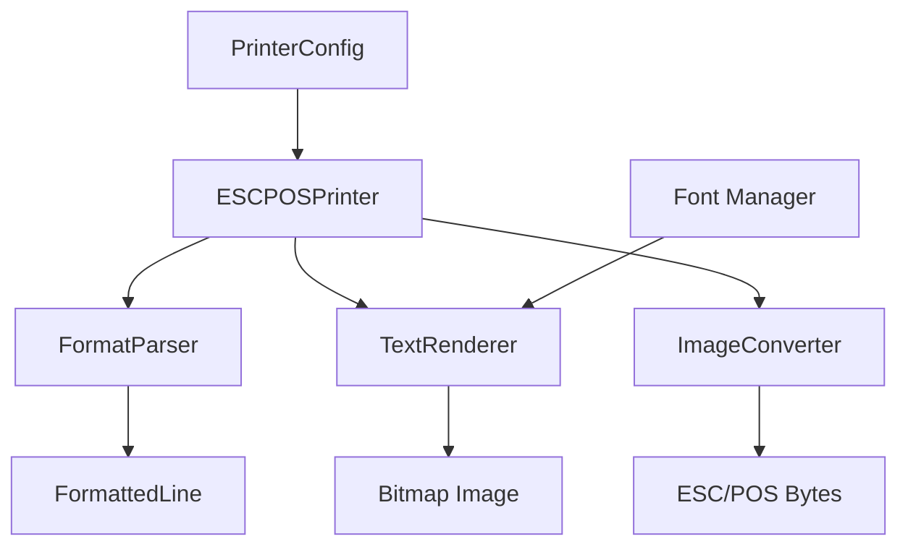

# Design Document: Vietnamese Image-Based Printing

## Overview

This design implements image-based printing for Vietnamese text on ESC/POS thermal printers. Instead of relying on character encoding (TCVN3), the system converts text content to bitmap images and sends them to the printer using ESC/POS bitmap commands. This approach provides reliable rendering of Vietnamese characters with proper formatting support.

The implementation maintains the existing `Printer` interface, ensuring backward compatibility with calling code. The core change is in the `convertToESCPOS` method, which will now generate bitmap images instead of encoding text.

## Architecture

### High-Level Flow

```
Text Content → Format Parser → Text Renderer → Bitmap Image → Image Converter → ESC/POS Commands → Printer
```

### Component Diagram



### Key Design Decisions

1. **In-Memory Image Generation**: Images are generated in memory and converted to ESC/POS format without writing to disk, minimizing I/O overhead.

2. **GS v 0 Command**: Use the GS v 0 (raster image) command instead of ESC * (bit image) for better compatibility and simpler implementation.

3. **Go Image Libraries**: Use Go's standard `image`, `image/draw`, and `golang.org/x/image/font` packages for rendering.

4. **Font Embedding**: Support both system fonts and embedded font files to ensure Vietnamese character support.

5. **Single-Pass Rendering**: Render the entire receipt as one image to maintain consistent formatting and spacing.

## Components and Interfaces

### 1. FormatParser

Parses text content and identifies formatting requirements for each line.

```go
type LineFormat struct {
    Text      string
    Bold      bool
    Alignment Alignment // LEFT, CENTER, RIGHT
    IsSeparator bool
}

type Alignment int

const (
    AlignLeft Alignment = iota
    AlignCenter
    AlignRight
)

type FormatParser struct {
    paperWidth int
}

func NewFormatParser(paperWidth int) *FormatParser

func (p *FormatParser) Parse(content string) []LineFormat
```

**Methods:**
- `Parse(content string) []LineFormat`: Parses text content and returns formatted lines
- `detectAlignment(line string) Alignment`: Determines alignment based on line content
- `detectBold(line string) bool`: Determines if line should be bold
- `isSeparator(line string) bool`: Checks if line is a separator

### 2. TextRenderer

Renders formatted text lines to a bitmap image.

```go
type TextRenderer struct {
    pixelWidth  int
    normalFont  font.Face
    boldFont    font.Face
    fontSize    float64
    lineSpacing int
    margin      int
}

func NewTextRenderer(config *RendererConfig) (*TextRenderer, error)

func (r *TextRenderer) Render(lines []LineFormat) (*image.Gray, error)
```

**Methods:**
- `Render(lines []LineFormat) (*image.Gray, error)`: Renders lines to a grayscale image
- `measureText(text string, fontFace font.Face) int`: Measures text width in pixels
- `calculateImageHeight(lines []LineFormat) int`: Calculates total image height
- `drawLine(img *image.Gray, line LineFormat, y int) int`: Draws a single line and returns next Y position

### 3. ImageConverter

Converts bitmap images to ESC/POS raster format.

```go
type ImageConverter struct {
    pixelWidth int
}

func NewImageConverter(pixelWidth int) *ImageConverter

func (c *ImageConverter) ConvertToESCPOS(img *image.Gray) []byte
```

**Methods:**
- `ConvertToESCPOS(img *image.Gray) []byte`: Converts image to ESC/POS GS v 0 format
- `imageToRaster(img *image.Gray) []byte`: Converts image pixels to raster byte array
- `applyThreshold(img *image.Gray) *image.Gray`: Applies threshold to create pure black/white image

### 4. FontManager

Manages font loading and provides font faces for rendering.

```go
type FontManager struct {
    fontPaths   []string
    normalSize  float64
    boldSize    float64
}

func NewFontManager(config *FontConfig) *FontManager

func (m *FontManager) LoadFonts() (normalFont, boldFont font.Face, err error)
```

**Methods:**
- `LoadFonts() (normalFont, boldFont font.Face, err error)`: Loads normal and bold font faces
- `loadFontFromPath(path string, size float64) (font.Face, error)`: Loads a font from file
- `findSystemFont() (string, error)`: Searches for Vietnamese-compatible system fonts

### 5. Updated ESCPOSPrinter

The existing printer implementation with modified internal logic.

```go
type ESCPOSPrinter struct {
    config        *printing.PrinterConfig
    conn          net.Conn
    formatParser  *FormatParser
    textRenderer  *TextRenderer
    imageConverter *ImageConverter
}

func NewESCPOSPrinter(config *printing.PrinterConfig) (Printer, error)

func (p *ESCPOSPrinter) Print(content string) error
```

**Modified Methods:**
- `NewESCPOSPrinter`: Now initializes image-based components
- `Print(content string) error`: Now uses image-based rendering
- `convertToESCPOS(content string) []byte`: Now generates image and converts to ESC/POS

## Data Models

### RendererConfig

Configuration for the text renderer.

```go
type RendererConfig struct {
    PixelWidth  int
    FontPath    string
    FontSize    float64
    LineSpacing int
    Margin      int
}
```

### FontConfig

Configuration for font management.

```go
type FontConfig struct {
    FontPaths  []string
    NormalSize float64
    BoldSize   float64
}
```

### ESC/POS Command Constants

```go
const (
    // GS v 0 - Print raster bit image
    GS_V_0 = []byte{0x1D, 0x76, 0x30}
    
    // Image mode: normal (0x00)
    IMAGE_MODE_NORMAL = 0x00
)
```

### Pixel Width Mapping

```go
const (
    PIXEL_WIDTH_58MM = 384  // 58mm paper at 203 DPI
    PIXEL_WIDTH_80MM = 576  // 80mm paper at 203 DPI
    DPI = 203               // Standard thermal printer resolution
)
```

## Correctness Properties

*A property is a characteristic or behavior that should hold true across all valid executions of a system—essentially, a formal statement about what the system should do. Properties serve as the bridge between human-readable specifications and machine-verifiable correctness guarantees.*


### Property 1: Vietnamese Text Rendering

*For any* Vietnamese text string, the Text_Renderer should successfully convert it to a valid monochrome bitmap image without errors.

**Validates: Requirements 1.1**

### Property 2: Vietnamese Character Support

*For any* Vietnamese Unicode character (including all tones and diacritics), the Text_Renderer should render it without missing glyphs or errors.

**Validates: Requirements 1.2**

### Property 3: Pixel Width Calculation

*For any* paper width configuration (58mm or 80mm), the System should calculate the correct pixel width (384 or 576 pixels respectively) based on 203 DPI.

**Validates: Requirements 1.3**

### Property 4: Line Break Preservation

*For any* multi-line text content, the Text_Renderer should preserve all line breaks and maintain correct vertical spacing between lines.

**Validates: Requirements 1.4**

### Property 5: Text Wrapping at Word Boundaries

*For any* text line that exceeds the pixel width, the Text_Renderer should wrap the text to the next line at word boundaries (spaces) rather than mid-word.

**Validates: Requirements 1.5, 7.4**

### Property 6: Bold Text Rendering

*For any* line marked as bold, the Text_Renderer should render it with visibly increased font weight compared to normal text.

**Validates: Requirements 2.1, 4.4**

### Property 7: Text Alignment

*For any* line with specified alignment (left, center, or right), the Text_Renderer should position the text correctly within the pixel width according to the alignment setting.

**Validates: Requirements 2.2, 2.3, 2.4**

### Property 8: Image to ESC/POS Conversion

*For any* valid bitmap image, the Image_Converter should successfully convert it to ESC/POS byte format without errors.

**Validates: Requirements 3.1**

### Property 9: ESC/POS Command Format

*For any* converted image, the Image_Converter should produce a byte stream that starts with either ESC * or GS v 0 command prefix.

**Validates: Requirements 3.2**

### Property 10: Byte Alignment

*For any* converted image, the Image_Converter should ensure the byte count per line is properly aligned for the printer (width in pixels / 8, rounded up).

**Validates: Requirements 3.3**

### Property 11: Image Width Handling

*For any* image with width matching the printer's pixel width, the Image_Converter should process it without errors or data loss.

**Validates: Requirements 3.4**

### Property 12: Byte Stream Optimization

*For any* converted image, the output byte stream size should not exceed the input image size by more than a reasonable overhead (header + alignment padding).

**Validates: Requirements 3.5**

### Property 13: Receipt Header Formatting

*For any* receipt template with header sections, the FormatParser should identify them and apply centered, bold formatting.

**Validates: Requirements 5.1**

### Property 14: Receipt Item Formatting

*For any* receipt template with item lines, the FormatParser should identify them and apply left-aligned formatting.

**Validates: Requirements 5.2**

### Property 15: Receipt Total Formatting

*For any* receipt template with total lines, the FormatParser should identify them and apply bold formatting.

**Validates: Requirements 5.3**

### Property 16: Receipt Footer Formatting

*For any* receipt template with footer sections, the FormatParser should identify them and apply centered formatting.

**Validates: Requirements 5.4**

### Property 17: Vertical Spacing Preservation

*For any* receipt template with empty lines between sections, the System should preserve the vertical spacing in the rendered image.

**Validates: Requirements 5.5**

### Property 18: Print Method Execution

*For any* valid text content, calling the Print method should complete the full workflow (parse, render, convert, send) without errors.

**Validates: Requirements 6.2**

### Property 19: Configuration Reading

*For any* valid PrinterConfig, the System should correctly read and apply the paper width setting.

**Validates: Requirements 7.5**

### Property 20: Anti-Aliasing Application

*For any* text rendering, the System should apply anti-aliasing to produce smoother character edges.

**Validates: Requirements 9.1**

### Property 21: Monochrome Threshold

*For any* grayscale image conversion to monochrome, the System should apply a threshold that produces clear, readable text without excessive noise.

**Validates: Requirements 9.2**

### Property 22: Image Height Optimization

*For any* rendered content, the image height should match the content height plus minimal padding, without excessive blank space.

**Validates: Requirements 9.3**

### Property 23: Memory Constraint Compliance

*For any* generated byte stream, the size should be within typical thermal printer memory constraints (typically < 1MB per image).

**Validates: Requirements 9.4**

### Property 24: Configuration Application

*For any* valid configuration settings (font paths, font sizes, line spacing, margins, command format), the System should correctly apply them during rendering and conversion.

**Validates: Requirements 10.1, 10.2, 10.3, 10.4, 10.5**

## Error Handling

### Error Types

1. **Font Loading Errors**
   - Missing font file
   - Corrupted font file
   - Unsupported font format
   - Return: descriptive error with font path

2. **Rendering Errors**
   - Invalid text encoding
   - Font face creation failure
   - Image allocation failure
   - Return: descriptive error with context

3. **Conversion Errors**
   - Invalid image format
   - Image dimensions mismatch
   - Byte alignment failure
   - Return: descriptive error with details

4. **Printer Communication Errors**
   - Connection timeout
   - Write failure
   - Printer offline
   - Return: descriptive error with printer address

5. **Validation Errors**
   - Empty content
   - Invalid configuration
   - Unsupported paper width
   - Return: descriptive error with validation details

### Error Handling Strategy

- All errors should be wrapped with context using `fmt.Errorf`
- Errors should propagate up the call stack with additional context at each level
- The Print method should return errors to the caller for handling
- No silent failures - all errors must be reported
- Log errors at appropriate levels (error, warning, info)

## Testing Strategy

### Dual Testing Approach

The testing strategy combines unit tests and property-based tests for comprehensive coverage:

- **Unit tests**: Verify specific examples, edge cases, and error conditions
- **Property tests**: Verify universal properties across all inputs
- Both approaches are complementary and necessary

### Unit Testing Focus

Unit tests should focus on:
- Specific Vietnamese character rendering examples
- Separator line rendering (=== and ---)
- Empty line handling
- Paper width mappings (58mm → 384px, 80mm → 576px)
- Font loading with valid TTF files
- Error cases (missing fonts, empty content, invalid images)
- Connection and disconnection flows
- Status retrieval
- DPI setting verification

### Property-Based Testing

Use a Go property-based testing library (e.g., `gopter` or `rapid`) for property tests.

**Configuration:**
- Minimum 100 iterations per property test
- Each test must reference its design document property
- Tag format: `// Feature: vietnamese-image-printing, Property {number}: {property_text}`

**Property Test Coverage:**
- Property 1-24 should each have a corresponding property-based test
- Generate random Vietnamese text strings
- Generate random receipt templates
- Generate random configuration values
- Generate random bitmap images for conversion testing

### Test Data Generators

Create generators for:
- Vietnamese text strings (with various tones and diacritics)
- Receipt templates (with headers, items, totals, footers)
- Bitmap images (various sizes and content)
- Configuration objects (various paper widths, font sizes, etc.)

### Integration Testing

- Test the full workflow: text → image → ESC/POS → printer
- Use a mock printer connection for testing
- Verify byte streams match expected ESC/POS format
- Test with actual printer hardware (manual testing)

### Performance Testing

- Measure rendering time for typical receipts (should be < 100ms)
- Measure memory usage during image generation (should be < 10MB)
- Test with large receipts (100+ lines)
- Verify no memory leaks during repeated printing

## Implementation Notes

### Font Selection Priority

1. Check configured font path first
2. Fall back to system fonts in this order:
   - Arial Unicode MS (Windows, macOS)
   - Roboto (Linux, Android)
   - DejaVu Sans (Linux)
   - Noto Sans (cross-platform)

### Image Resolution

- Use 203 DPI (dots per inch) as standard thermal printer resolution
- 58mm paper: 58mm / 25.4mm * 203 DPI ≈ 384 pixels
- 80mm paper: 80mm / 25.4mm * 203 DPI ≈ 576 pixels

### GS v 0 Command Format

```
GS v 0 m xL xH yL yH [d]k
- GS v 0: Command prefix (0x1D 0x76 0x30)
- m: Mode (0x00 for normal)
- xL, xH: Width in bytes (little-endian)
- yL, yH: Height in pixels (little-endian)
- [d]k: Raster data (width_bytes * height bytes)
```

### Monochrome Conversion

- Use threshold of 128 (middle gray) for converting grayscale to black/white
- Pixels >= 128 → white (0)
- Pixels < 128 → black (1)

### Line Spacing

- Default line spacing: 1.2x font size
- Configurable via RendererConfig
- Separator lines: 0.5x font size padding above and below

### Margins

- Default left/right margins: 8 pixels
- Configurable via RendererConfig
- Ensures text doesn't print at paper edge

## Migration Path

### Backward Compatibility

- The Printer interface remains unchanged
- Calling code requires no modifications
- Configuration (PrinterConfig) remains unchanged

### Deployment Steps

1. Add font files to deployment package or ensure system fonts available
2. Update ESCPOSPrinter implementation
3. Test with actual printer hardware
4. Deploy to production
5. Monitor for errors and adjust threshold/fonts as needed

### Rollback Plan

- Keep old TCVN3-based implementation as backup
- Add feature flag to switch between implementations
- If issues arise, switch back to TCVN3 mode

### Performance Considerations

- Image generation adds ~50-100ms per receipt
- Memory usage increases by ~5-10MB during rendering
- Network bandwidth increases slightly (images vs text)
- Overall impact should be minimal for typical use cases
